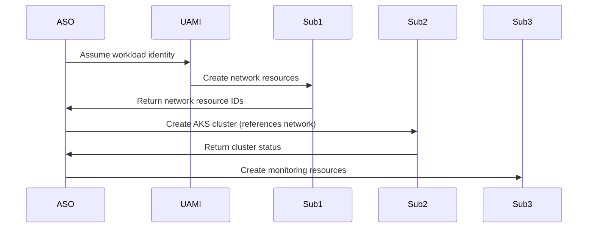

# Story 1.3: Cross-Subscription RBAC Configuration

<!-- Powered by BMAD™ Core -->

## Status
Draft

## Story
**As a** Platform Engineer,
**I want** to configure cross-subscription RBAC for ASO,
**So that** the management cluster can provision resources across subscriptions.

## Acceptance Criteria
1. User Assigned Managed Identity created
2. Custom RBAC role "ASO Cross-Subscription Deployer" defined
3. RBAC assigned across all target subscriptions
4. Resource provider registration completed
5. Permission validation tests pass

## Tasks / Subtasks
- [ ] Create User Assigned Managed Identity for ASO (AC: 1)
  - [ ] Create UAMI in management cluster resource group
  - [ ] Configure managed identity with cross-subscription access
  - [ ] Document identity configuration and access patterns
- [ ] Define custom RBAC role with minimal required permissions (AC: 2)
  - [ ] Analyze required permissions for ASO resource provisioning
  - [ ] Create custom role definition with least privilege principle
  - [ ] Include permissions for resource groups, AKS, networking, monitoring
  - [ ] Exclude unnecessary permissions following zero-trust model
- [ ] Assign RBAC across networking, compute, monitoring subscriptions (AC: 3)
  - [ ] Assign custom role to UAMI in network subscription
  - [ ] Assign custom role to UAMI in compute subscriptions (dev, staging, prod)
  - [ ] Assign custom role to UAMI in monitoring subscription
  - [ ] Configure conditional access policies for additional security
- [ ] Register required resource providers (AC: 4)
  - [ ] Register Microsoft.ContainerService provider
  - [ ] Register Microsoft.Network provider
  - [ ] Register Microsoft.ManagedIdentity provider
  - [ ] Register Microsoft.Insights provider
  - [ ] Validate all providers are registered across subscriptions
- [ ] Create permission validation script (AC: 5)
  - [ ] Create automated validation script for cross-subscription permissions
  - [ ] Test resource group creation in each subscription
  - [ ] Test AKS cluster provisioning permissions
  - [ ] Test network resource management permissions
  - [ ] Document validation procedures and troubleshooting
- [ ] Document RBAC architecture (AC: 2, 3, 5)
  - [ ] Create comprehensive RBAC documentation
  - [ ] Document security boundaries and access patterns
  - [ ] Create troubleshooting guide for permission issues
  - [ ] Document emergency access procedures

## Dev Notes

### Previous Story Context
This story builds on Story 1.1 (Management Cluster Deployment) which provides the foundation cluster where ASO will be installed.

### RBAC Architecture
**Custom RBAC Role Definition** [Source: architecture.md#security-architecture]:
```json
{
  "Name": "ASO Cross-Subscription Deployer",
  "Description": "Custom role for Azure Service Operator cross-subscription resource deployment",
  "Actions": [
    "Microsoft.Resources/subscriptions/resourceGroups/*",
    "Microsoft.ContainerService/managedClusters/*",
    "Microsoft.ContainerService/managedClusters/agentPools/*",
    "Microsoft.Network/virtualNetworks/*",
    "Microsoft.Network/virtualNetworks/subnets/*",
    "Microsoft.Network/networkSecurityGroups/*",
    "Microsoft.Network/privateDnsZones/*",
    "Microsoft.ManagedIdentity/userAssignedIdentities/*",
    "Microsoft.ManagedIdentity/userAssignedIdentities/federatedIdentityCredentials/*",
    "Microsoft.OperationalInsights/workspaces/*",
    "Microsoft.Insights/dataCollectionRules/*",
    "Microsoft.Insights/actionGroups/*",
    "Microsoft.AlertsManagement/prometheusRuleGroups/*"
  ],
  "NotActions": [],
  "DataActions": [],
  "NotDataActions": []
}
```

**Cross-Subscription Access Pattern** [Source: architecture.md#cross-subscription-resource-model]:
- Management Subscription: UAMI location and federated credentials
- Network Subscription: VNet, subnets, NSGs, private DNS zones
- Compute Subscriptions: Resource groups, AKS clusters, node pools
- Monitoring Subscription: Log Analytics, monitoring resources

### Identity and Federation
**Workload Identity Configuration** [Source: architecture.md#security-architecture]:
- OIDC Issuer URL from management cluster
- Federated identity credentials linked to service account
- Subject identifier following pattern: `system:serviceaccount:azure-service-operator-system:azureserviceoperator-default`
- Audience: `api://AzureADTokenExchange`

**Cross-Subscription Resource Provisioning Flow** [Source: architecture.md#integration-patterns]:


### Security Controls
**RBAC Security Matrix** [Source: architecture.md#security-controls-matrix]:
- Network Layer: Private clusters, bastion access, NSGs
- Identity Layer: Workload identity, federated credentials, conditional access
- Access Layer: Custom roles, least privilege, audit logging
- Runtime Layer: Pod security standards, network policies

### Resource Provider Requirements
**Required Providers** [Source: architecture.md#azure-service-operator]:
- Microsoft.ContainerService (AKS clusters and node pools)
- Microsoft.Network (Virtual networks, subnets, NSGs)
- Microsoft.ManagedIdentity (User assigned identities, federated credentials)
- Microsoft.Insights (Monitoring and alerting resources)
- Microsoft.OperationalInsights (Log Analytics workspaces)

### File Locations
**Management Cluster Structure** [Source: folder-structure.md]:
- `eng/azureserviceoperator/managementcluster/rbac/` - RBAC policies and role definitions
- `eng/azureserviceoperator/managementcluster/identity/` - UAMI and federated credentials
- `eng/azureserviceoperator/managementcluster/configmap/` - Cross-subscription configuration variables

### Technical Constraints
**Security Requirements** [Source: architecture.md#security-architecture]:
- Zero-trust security model implementation
- Principle of least privilege for all permissions
- Comprehensive audit logging for all RBAC actions
- Conditional access policies for enhanced security
- Regular access reviews and permission validation

## Testing

### Permission Validation
- Cross-subscription resource group creation testing
- AKS cluster provisioning permission validation
- Network resource management testing
- Monitoring resource creation validation
- Error handling and troubleshooting verification

### Security Testing
- RBAC permission boundary testing
- Workload identity authentication validation
- Audit log generation verification
- Unauthorized access attempt testing

## Change Log
| Date | Version | Description | Author |
|------|---------|-------------|--------|
| 2025-01-19 | 1.0 | Initial story creation | Scrum Master |

## Dev Agent Record
*This section will be populated by the development agent during implementation*

### Agent Model Used
*To be filled by dev agent*

### Debug Log References
*To be filled by dev agent*

### Completion Notes List
*To be filled by dev agent*

### File List
*To be filled by dev agent*

## QA Results
*This section will be populated by the QA agent after story completion*