# Architecture Document
## ARM Template to Azure Service Operator Migration with Management Cluster

---

### Document Information
- **Version**: 1.0
- **Date**: 2025-01-19
- **Status**: Draft
- **Architect**: Platform Engineering Team
- **Reviewers**: Security Team, Network Team, Development Teams

---

## Table of Contents
1. [Executive Summary](#1-executive-summary)
2. [Current State Architecture](#2-current-state-architecture)
3. [Target State Architecture](#3-target-state-architecture)
4. [Migration Architecture](#4-migration-architecture)
5. [Security Architecture](#5-security-architecture)
6. [Network Architecture](#6-network-architecture)
7. [Data Architecture](#7-data-architecture)
8. [Technology Stack](#8-technology-stack)
9. [Integration Patterns](#9-integration-patterns)
10. [Operational Architecture](#10-operational-architecture)
11. [Migration Strategy](#11-migration-strategy)
12. [Risk Assessment](#12-risk-assessment)

---

## 1. Executive Summary

### 1.1 Architecture Vision
Transform from ARM template-based infrastructure provisioning to a Kubernetes-native Azure Service Operator architecture with centralized management cluster orchestration, enabling GitOps-driven infrastructure management across multiple environments and subscriptions.

### 1.2 Key Architectural Decisions

| Decision | Rationale | Impact |
|----------|-----------|--------|
| **Management Cluster Pattern** | Centralized control, consistent policies | Single point of orchestration |
| **Azure Service Operator v2** | Kubernetes-native Azure resources | Unified infrastructure/app management |
| **Flux v2 GitOps** | Git-based infrastructure as code | Declarative, auditable changes |
| **Workload Identity** | Eliminate secrets, enhance security | Zero-trust authentication |
| **Node Auto Provisioning** | Cost optimization, reduced management | Automated node lifecycle |
| **Cilium Networking** | Advanced security, observability | Enhanced network capabilities |

### 1.3 Architecture Principles

#### Cloud-Native First
- **Kubernetes-native resource management** for unified operations
- **GitOps-driven workflows** for declarative infrastructure
- **Container-first architecture** for portability and scalability

#### Security by Design
- **Zero-trust network architecture** with private clusters
- **Workload identity** for passwordless authentication
- **Defense in depth** with multiple security layers

#### Operational Excellence
- **Infrastructure as Code** with full version control
- **Automated reconciliation** with drift detection
- **Comprehensive observability** for proactive operations

---

## 2. Current State Architecture

### 2.1 Current Infrastructure Model

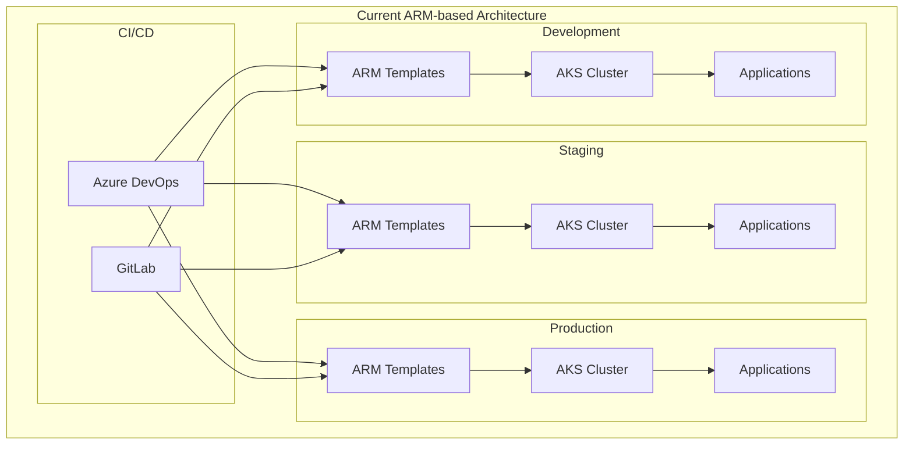

### 2.2 Current ARM Template Analysis

Based on the official ARM template (`arm/official.json`), the current implementation includes:

#### Resource Configuration
```json
{
  "type": "Microsoft.ContainerService/managedClusters",
  "apiVersion": "2025-05-02-preview",
  "properties": {
    "nodeProvisioningProfile": {
      "mode": "string"  // Currently manual mode
    },
    "networkProfile": {
      "networkPlugin": "string",
      "networkPolicy": "string",
      "serviceCidr": "string",
      "dnsServiceIP": "string"
    },
    "securityProfile": {
      "workloadIdentity": {
        "enabled": "bool"
      }
    }
  }
}
```

#### Current Limitations
- **Static Configuration**: ARM templates require redeployment for changes
- **Limited GitOps**: No native Kubernetes integration
- **Fragmented Management**: Separate infrastructure and application pipelines
- **Complex RBAC**: Different access models for infrastructure vs. applications
- **Manual Scaling**: Node provisioning requires manual intervention

### 2.3 Current Network Architecture

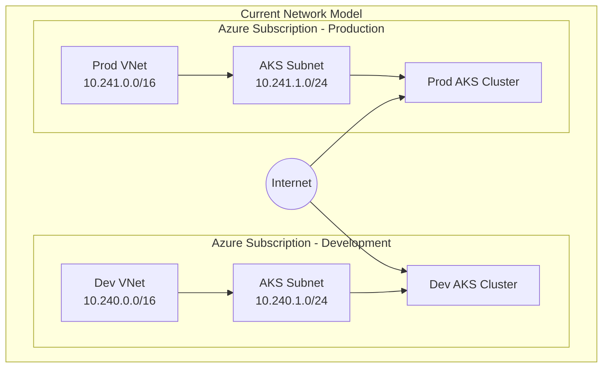

#### Current Network Challenges
- **Public Endpoints**: Clusters exposed to internet
- **Limited Segmentation**: Basic network isolation
- **Manual Configuration**: Network changes require ARM redeployment
- **Inconsistent Policies**: Different security rules across environments

---

## 3. Target State Architecture

### 3.1 Management Cluster Architecture

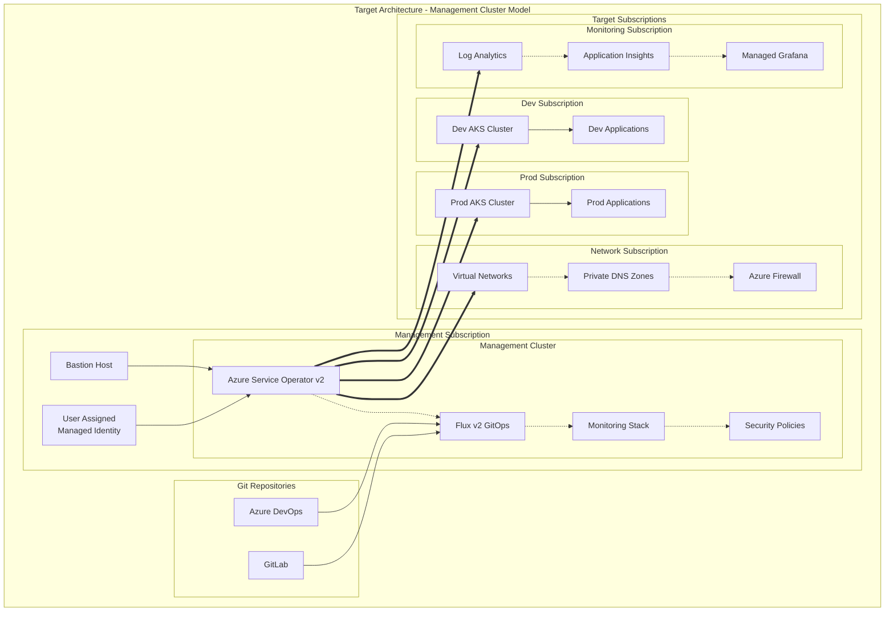

### 3.2 Cross-Subscription Resource Model

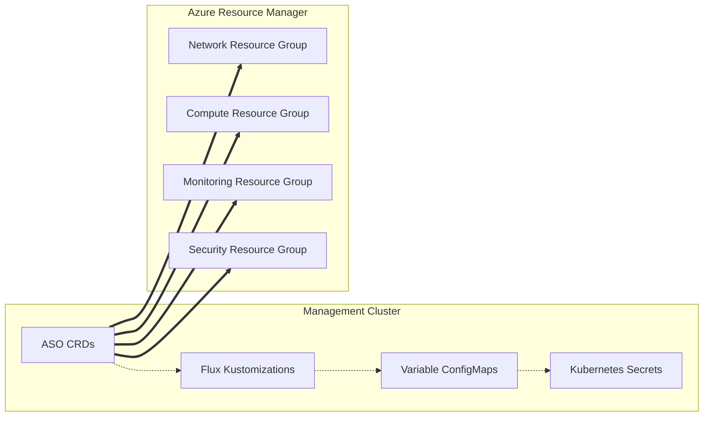

### 3.3 Target Technology Stack

#### Core Platform Components
```yaml
management_cluster:
  kubernetes_version: "1.29"
  node_provisioning: "Auto"  # NAP enabled
  network_plugin: "azure"
  network_mode: "overlay"
  network_policy: "cilium"
  network_dataplane: "cilium"

  components:
    azure_service_operator:
      version: "v2.x"
      api_version: "v1api20240402preview"

    flux:
      version: "v2.x"
      components:
        - "source-controller"
        - "kustomize-controller"
        - "notification-controller"

    security:
      workload_identity: true
      oidc_issuer: true
      azure_rbac: true
      pod_security_standards: "restricted"

    networking:
      service_mesh: "istio"
      ingress: "istio-ingress"
      load_balancer: "standard"

    monitoring:
      prometheus: true
      grafana: true
      jaeger: true
      azure_monitor: true
```

### 3.4 Azure Service Operator Resource Hierarchy

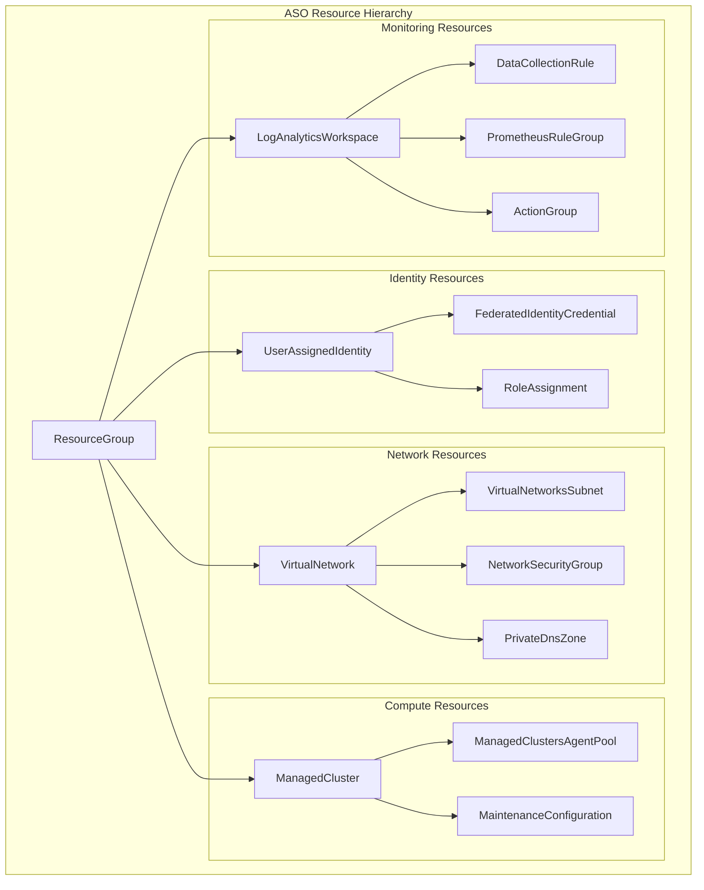

---

## 4. Migration Architecture

### 4.1 Blue-Green Migration Strategy

```mermaid
graph TB
    subgraph "Migration Strategy - Blue-Green Pattern"
        subgraph "Phase 1: Parallel Infrastructure"
            CurrentCluster[Current AKS<br/>(Blue)]
            NewCluster[New ASO AKS<br/>(Green)]
            LoadBalancer[Load Balancer]

            CurrentCluster -.-> LoadBalancer
            NewCluster -.-> LoadBalancer
        end

        subgraph "Phase 2: Traffic Switching"
            TrafficSplit[Traffic Split<br/>Blue: 100% → 0%<br/>Green: 0% → 100%]
            Monitoring[Migration Monitoring]
            Rollback[Rollback Capability]

            TrafficSplit -.-> Monitoring
            Monitoring -.-> Rollback
        end

        subgraph "Phase 3: Decommissioning"
            Validation[Service Validation]
            Cleanup[Blue Infrastructure<br/>Cleanup]

            Validation --> Cleanup
        end
    end
```

### 4.2 Migration Timeline Architecture

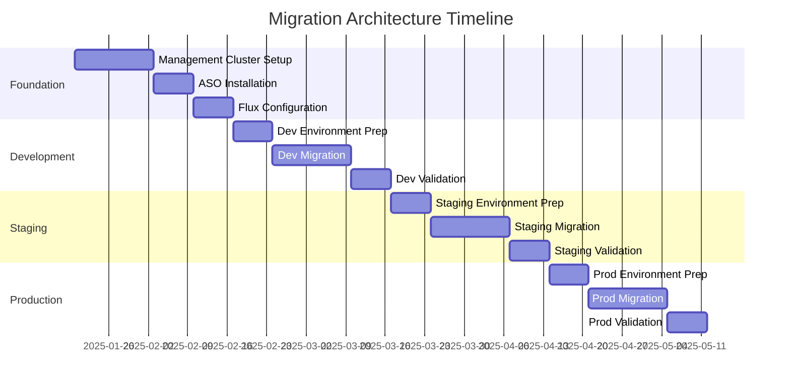

### 4.3 Component Migration Mapping

| Current Component | Target Component | Migration Strategy |
|-------------------|------------------|--------------------|
| **ARM Template** | **ASO CRDs** | 1:1 resource mapping with GitOps |
| **Azure DevOps Pipeline** | **Flux Kustomization** | Git-based reconciliation |
| **Manual Node Scaling** | **Node Auto Provisioning** | Policy-driven automation |
| **Service Principal Auth** | **Workload Identity** | Federated credentials |
| **Public Clusters** | **Private Clusters** | Network security enhancement |
| **Basic Monitoring** | **Comprehensive Observability** | Full stack monitoring |

---

## 5. Security Architecture

### 5.1 Zero-Trust Security Model

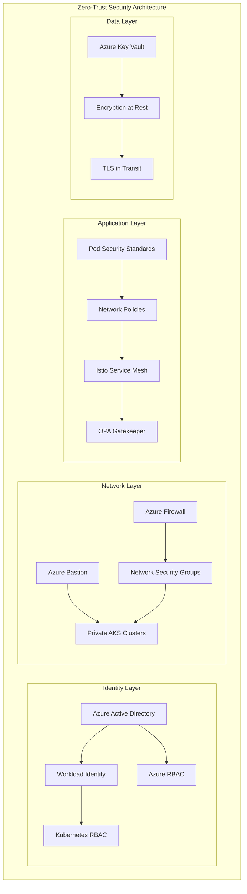

### 5.2 RBAC Architecture

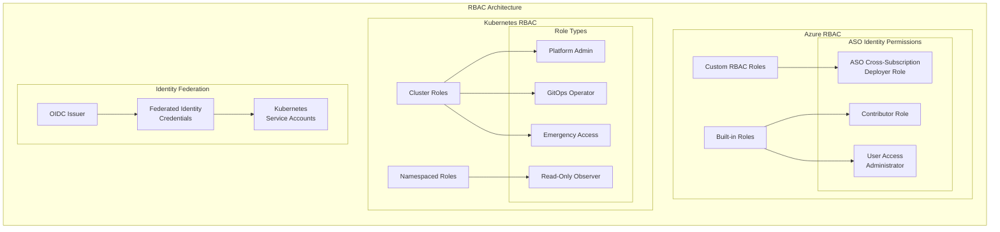

### 5.3 Security Controls Matrix

| Security Layer | Current State | Target State | Controls |
|----------------|---------------|--------------|-----------|
| **Network** | Public clusters | Private clusters | Bastion, firewall, NSGs |
| **Identity** | Service principals | Workload identity | Federated credentials |
| **Access** | Basic RBAC | Comprehensive RBAC | Custom roles, conditional access |
| **Runtime** | Basic policies | Pod security standards | OPA Gatekeeper, network policies |
| **Data** | Basic encryption | Comprehensive encryption | KMS, TLS, at-rest encryption |
| **Monitoring** | Limited logs | Full observability | Audit logs, security monitoring |

---

## 6. Network Architecture

### 6.1 Target Network Topology

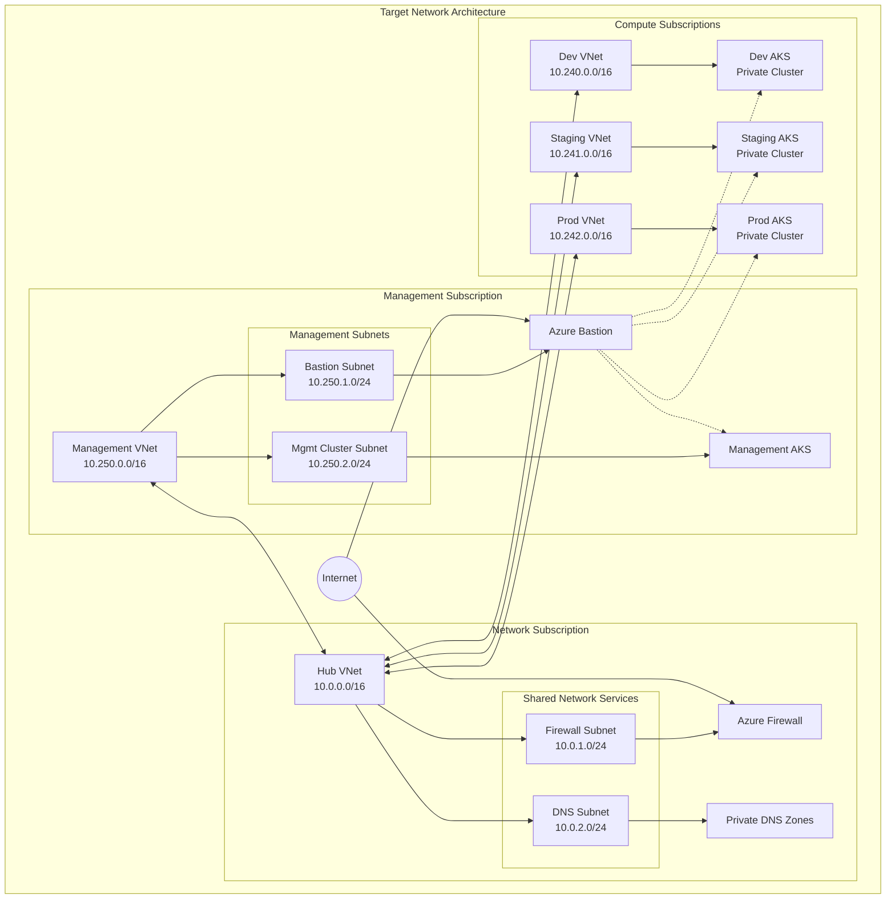

### 6.2 Network Segmentation Strategy

#### Subscription-Level Isolation
```yaml
network_segmentation:
  management_tier:
    vnet_cidr: "10.250.0.0/16"
    subnets:
      bastion: "10.250.1.0/24"
      management_cluster: "10.250.2.0/24"
      monitoring: "10.250.3.0/24"

  network_tier:
    vnet_cidr: "10.0.0.0/16"
    subnets:
      firewall: "10.0.1.0/24"
      dns: "10.0.2.0/24"
      gateway: "10.0.3.0/24"

  environment_tiers:
    development:
      vnet_cidr: "10.240.0.0/16"
      subnets:
        aks_system: "10.240.1.0/24"
        aks_user: "10.240.2.0/24"
        private_endpoints: "10.240.3.0/24"

    staging:
      vnet_cidr: "10.241.0.0/16"
      subnets:
        aks_system: "10.241.1.0/24"
        aks_user: "10.241.2.0/24"
        private_endpoints: "10.241.3.0/24"

    production:
      vnet_cidr: "10.242.0.0/16"
      subnets:
        aks_system: "10.242.1.0/24"
        aks_user: "10.242.2.0/24"
        private_endpoints: "10.242.3.0/24"
```

### 6.3 Network Security Controls

#### Firewall Rules Architecture
```yaml
azure_firewall_rules:
  network_rules:
    management_cluster_outbound:
      priority: 100
      action: "Allow"
      source: "10.250.2.0/24"  # Management cluster
      destination: "10.240.0.0/16,10.241.0.0/16,10.242.0.0/16"
      ports: ["443", "22"]
      protocol: "TCP"

    aks_to_azure_services:
      priority: 200
      action: "Allow"
      source: "*"
      destination: "AzureCloud"
      ports: ["443"]
      protocol: "TCP"

  application_rules:
    container_registry:
      priority: 100
      source: "*"
      target_fqdns: ["*.azurecr.io", "mcr.microsoft.com"]
      protocol: "HTTPS"

    package_managers:
      priority: 200
      source: "*"
      target_fqdns: ["*.ubuntu.com", "security.ubuntu.com", "azure.archive.ubuntu.com"]
      protocol: "HTTPS"
```

---

## 7. Data Architecture

### 7.1 Data Flow Architecture

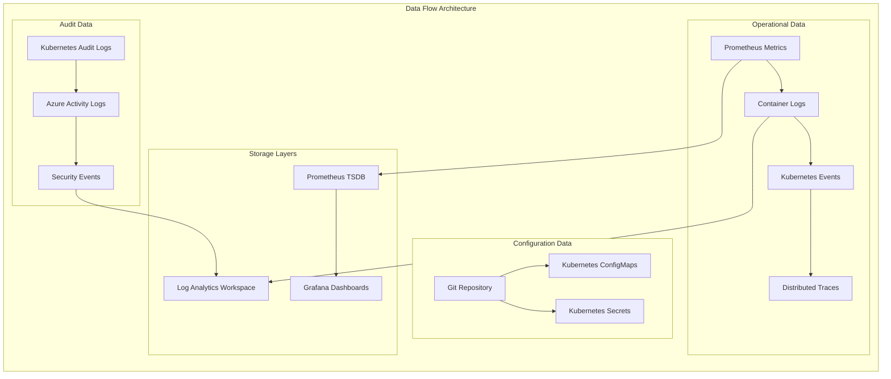

### 7.2 Data Persistence Strategy

#### State Management
```yaml
data_persistence:
  cluster_state:
    etcd:
      backup_frequency: "every_6_hours"
      retention_period: "30_days"
      encryption: "at_rest"
      location: "azure_blob_storage"

  application_data:
    persistent_volumes:
      storage_class: "azure_disk_premium"
      backup_policy: "daily"
      retention: "90_days"
      encryption: "customer_managed_keys"

  configuration_data:
    git_repository:
      backup_frequency: "real_time"
      retention: "unlimited"
      encryption: "in_transit_and_at_rest"

  observability_data:
    metrics:
      retention: "90_days"
      compression: "enabled"
      sampling_rate: "1m"

    logs:
      retention: "365_days"
      archival: "cold_storage_after_90_days"
      indexing: "full_text_search"
```

### 7.3 Data Security and Compliance

#### Encryption Strategy
```yaml
encryption_strategy:
  at_rest:
    azure_key_vault:
      key_rotation: "automatic_90_days"
      hsm_backed: true
      access_policies: "rbac_based"

    disk_encryption:
      customer_managed_keys: true
      double_encryption: true  # Production only
      key_vault_integration: true

  in_transit:
    tls_version: "1.3"
    certificate_management: "cert_manager_with_lets_encrypt"
    mutual_tls: true  # Service mesh

  application_secrets:
    storage: "kubernetes_secrets"
    external_secrets: "azure_key_vault_integration"
    rotation: "automated_30_days"
```

---

## 8. Technology Stack

### 8.1 Core Platform Stack

#### Kubernetes Platform
```yaml
kubernetes_platform:
  version: "1.29"
  distribution: "azure_aks"

  runtime:
    container_runtime: "containerd"
    cni: "azure_cni_overlay"
    csi_drivers:
      - "azure_disk"
      - "azure_file"
      - "azure_blob"
      - "secrets_store_csi"

  addons:
    dns: "coredns"
    ingress: "istio_ingress_gateway"
    service_mesh: "istio"
    monitoring: "prometheus_operator"
    logging: "fluent_bit"
    security: "opa_gatekeeper"
```

#### Azure Service Operator
```yaml
azure_service_operator:
  version: "v2.8.0+"
  api_versions:
    container_service: "v1api20240402preview"
    resources: "v1api20200601"
    managed_identity: "v1api20230131"
    network: "v1api20201101"
    insights: "v1api20230311"
    alerts_management: "v1api20230301"

  supported_resources:
    - "ResourceGroup"
    - "ManagedCluster"
    - "ManagedClustersAgentPool"
    - "UserAssignedIdentity"
    - "FederatedIdentityCredential"
    - "VirtualNetwork"
    - "VirtualNetworksSubnet"
    - "NetworkSecurityGroup"
    - "LogAnalyticsWorkspace"
    - "DataCollectionRule"
    - "PrometheusRuleGroup"
    - "ActionGroup"
```

### 8.2 GitOps Stack

#### Flux Configuration
```yaml
flux_gitops:
  version: "v2.2.0+"
  components:
    source_controller:
      git_repositories: true
      helm_repositories: true
      oci_repositories: true

    kustomize_controller:
      post_build_substitution: true
      health_checks: true
      dependency_management: true

    notification_controller:
      slack_integration: true
      email_notifications: true
      webhook_notifications: true

    image_automation_controller: false  # Not needed for infrastructure
    image_reflector_controller: false   # Not needed for infrastructure

  git_integration:
    repositories:
      - "azure_devops"
      - "gitlab"

    authentication:
      method: "ssh_key"
      key_rotation: "quarterly"

    branch_protection:
      required_reviews: 2
      status_checks: true
      force_push_protection: true
```

### 8.3 Security Stack

#### Security Tool Integration
```yaml
security_stack:
  runtime_security:
    falco:
      enabled: true
      rules: "cis_kubernetes_benchmark"
      alerts: "siem_integration"

    twistlock_prisma:
      enabled: true
      vulnerability_scanning: true
      compliance_monitoring: true

  policy_enforcement:
    opa_gatekeeper:
      version: "v3.14+"
      policies:
        - "pod_security_standards"
        - "network_policies"
        - "resource_quotas"
        - "image_scanning_requirements"

    azure_policy:
      kubernetes_integration: true
      compliance_frameworks:
        - "cis_benchmark"
        - "nist_800_53"
        - "pci_dss"

  secrets_management:
    external_secrets:
      version: "v0.9+"
      providers:
        - "azure_key_vault"
        - "azure_managed_identity"

    secrets_store_csi:
      version: "v1.4+"
      auto_rotation: true
      sync_secrets: true
```

### 8.4 Monitoring and Observability Stack

#### Observability Platform
```yaml
observability_stack:
  metrics:
    prometheus:
      version: "v2.47+"
      retention: "90d"
      storage: "azure_disk_premium"
      federation: "cross_cluster"

    azure_monitor:
      container_insights: true
      prometheus_metrics: true
      managed_grafana: true

  logging:
    fluent_bit:
      version: "v2.2+"
      outputs:
        - "azure_log_analytics"
        - "prometheus_metrics"

    azure_log_analytics:
      retention: "365d"
      data_export: "long_term_storage"

  tracing:
    jaeger:
      version: "v1.51+"
      storage: "elasticsearch"
      sampling_rate: "0.1"

    azure_application_insights:
      distributed_tracing: true
      correlation_id: true

  visualization:
    grafana:
      version: "v10.2+"
      dashboards:
        - "kubernetes_cluster_monitoring"
        - "application_performance"
        - "security_monitoring"
        - "cost_optimization"
```

---

## 9. Integration Patterns

### 9.1 GitOps Integration Pattern

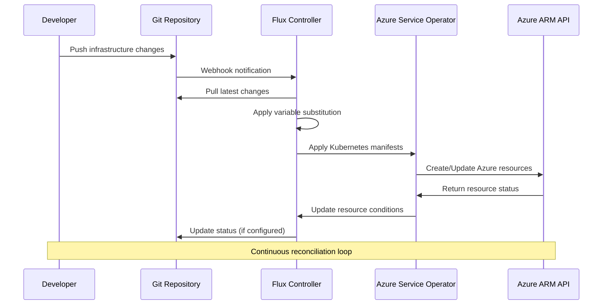

### 9.2 Cross-Subscription Resource Provisioning

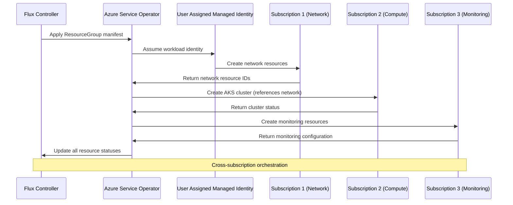

### 9.3 Security Integration Pattern

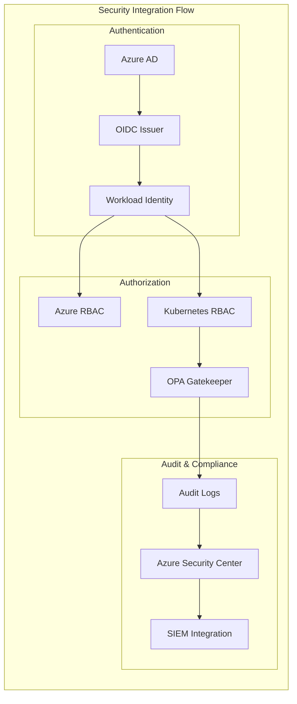

---

## 10. Operational Architecture

### 10.1 Operational Model

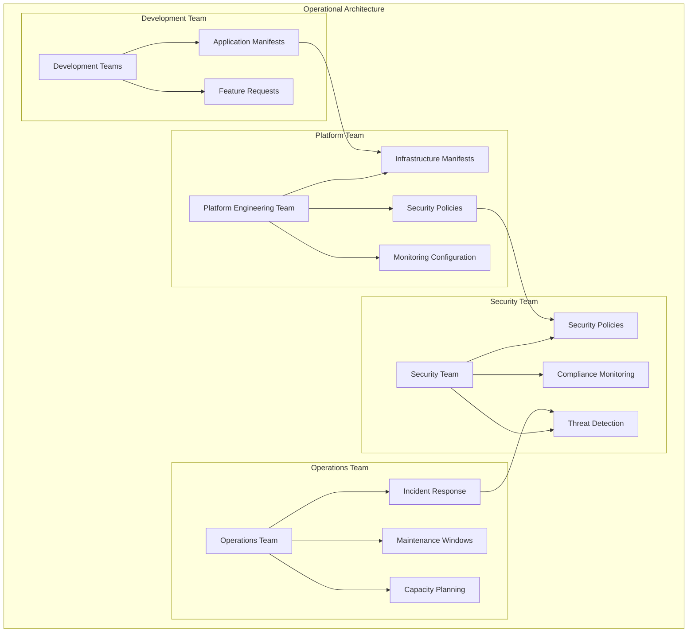

### 10.2 Monitoring and Alerting Architecture

```yaml
monitoring_architecture:
  infrastructure_monitoring:
    cluster_health:
      metrics:
        - "node_availability"
        - "pod_restart_rate"
        - "resource_utilization"
        - "network_latency"

      alerting:
        critical: "pagerduty"
        warning: "slack"
        info: "email"

    azure_resources:
      metrics:
        - "azure_service_operator_reconciliation"
        - "azure_resource_provisioning_time"
        - "azure_api_rate_limits"
        - "cross_subscription_access"

      dashboards:
        - "aso_operational_dashboard"
        - "azure_resource_inventory"
        - "cost_optimization_dashboard"

  application_monitoring:
    performance:
      apm: "azure_application_insights"
      tracing: "jaeger"
      metrics: "prometheus"

    business_metrics:
      deployment_frequency: true
      lead_time: true
      mttr: true
      change_failure_rate: true

  security_monitoring:
    siem_integration:
      provider: "azure_sentinel"
      log_sources:
        - "kubernetes_audit_logs"
        - "azure_activity_logs"
        - "aso_operator_logs"
        - "flux_controller_logs"

    threat_detection:
      behavioral_analytics: true
      anomaly_detection: true
      compliance_monitoring: true
```

### 10.3 Incident Response Architecture

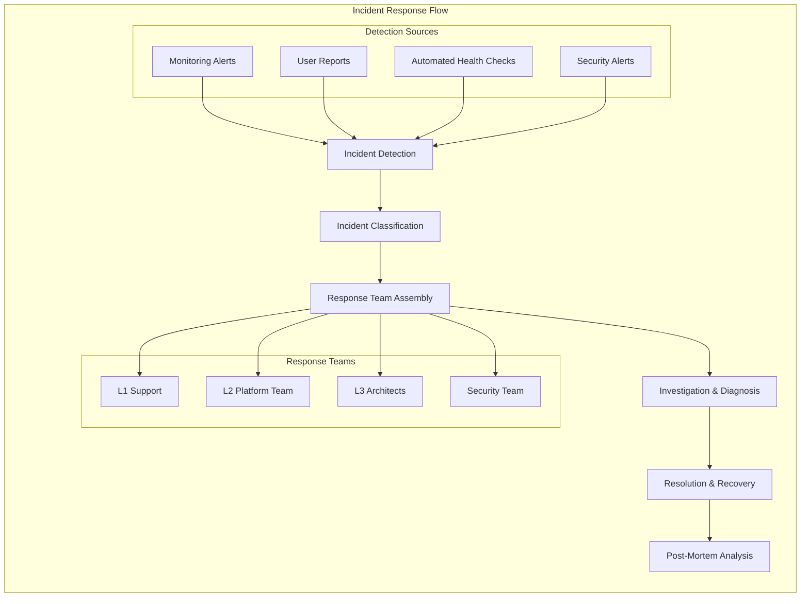

---

## 11. Migration Strategy

### 11.1 Migration Architecture Phases

#### Phase 1: Foundation Architecture
```yaml
phase_1_foundation:
  timeline: "weeks_1_4"

  components:
    management_cluster:
      deployment: "azure_aks_private"
      size: "standard_d8s_v5_3_nodes"
      networking: "azure_cni_overlay"
      security: "workload_identity_enabled"

    azure_service_operator:
      version: "v2_latest_stable"
      configuration: "cross_subscription_rbac"
      crds: "all_required_resources"

    flux_gitops:
      version: "v2_latest_stable"
      integration: "azure_devops_gitlab"
      features: "post_build_substitution"

    security_baseline:
      network: "private_cluster_bastion"
      rbac: "azure_rbac_k8s_rbac"
      policies: "pod_security_standards"

  validation_criteria:
    - "management_cluster_healthy"
    - "aso_can_provision_test_resources"
    - "flux_can_reconcile_changes"
    - "security_policies_enforced"
    - "cross_subscription_access_validated"
```

#### Phase 2: Development Environment Migration
```yaml
phase_2_development:
  timeline: "weeks_5_8"

  migration_strategy:
    parallel_deployment:
      current_cluster: "arm_template_aks"
      new_cluster: "aso_provisioned_aks"
      traffic_split: "gradual_0_to_100"

    application_migration:
      strategy: "blue_green_deployment"
      validation: "comprehensive_testing"
      rollback: "automated_if_failure"

    data_migration:
      persistent_volumes: "backup_restore"
      configurations: "gitops_conversion"
      secrets: "workload_identity_migration"

  success_criteria:
    - "all_dev_workloads_operational"
    - "performance_baseline_maintained"
    - "zero_data_loss"
    - "developer_workflow_improved"
    - "monitoring_fully_functional"
```

#### Phase 3: Staging Environment Migration
```yaml
phase_3_staging:
  timeline: "weeks_9_12"

  production_readiness:
    security_hardening:
      - "production_security_policies"
      - "compliance_validation"
      - "penetration_testing"
      - "security_audit"

    performance_validation:
      - "load_testing"
      - "stress_testing"
      - "capacity_planning"
      - "cost_optimization"

    disaster_recovery:
      - "backup_procedures"
      - "restore_procedures"
      - "failover_testing"
      - "business_continuity"

  acceptance_criteria:
    - "production_equivalent_security"
    - "performance_targets_met"
    - "dr_procedures_validated"
    - "compliance_requirements_met"
```

#### Phase 4: Production Migration
```yaml
phase_4_production:
  timeline: "weeks_13_16"

  migration_approach:
    blue_green_strategy:
      preparation: "full_production_replica"
      validation: "comprehensive_testing"
      cutover: "dns_traffic_switch"
      monitoring: "real_time_validation"
      rollback: "immediate_if_issues"

    business_continuity:
      maintenance_window: "minimal_impact_hours"
      communication: "stakeholder_notifications"
      support: "24_7_support_team"
      monitoring: "enhanced_alerting"

  success_metrics:
    - "zero_downtime_migration"
    - "performance_improvement"
    - "cost_reduction_achieved"
    - "security_posture_enhanced"
    - "operational_efficiency_improved"
```

### 11.2 Rollback Architecture

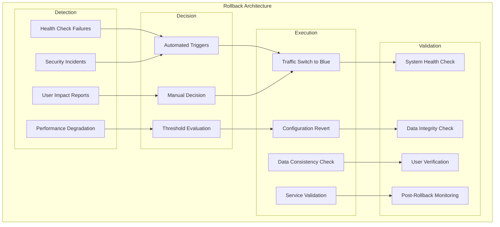

---

## 12. Risk Assessment

### 12.1 Technical Risk Analysis

| Risk Category | Risk Description | Probability | Impact | Mitigation Strategy |
|---------------|------------------|-------------|--------|-------------------|
| **Platform Stability** | ASO v2 production readiness | Medium | High | Comprehensive testing, vendor support |
| **Cross-Subscription RBAC** | Complex permission management | High | High | Detailed testing, phased rollout |
| **Network Connectivity** | Private cluster access issues | Medium | Medium | Blue-green deployment, monitoring |
| **Data Migration** | Data loss during migration | Low | High | Comprehensive backup, validation |
| **Performance** | Performance degradation | Low | Medium | Performance testing, monitoring |
| **Security** | Security control gaps | Low | High | Security audit, penetration testing |

### 12.2 Operational Risk Analysis

| Risk Category | Risk Description | Probability | Impact | Mitigation Strategy |
|---------------|------------------|-------------|--------|-------------------|
| **Team Readiness** | Insufficient team skills | Medium | Medium | Training program, documentation |
| **Change Management** | Resistance to new processes | Medium | Medium | Communication, gradual adoption |
| **Vendor Dependencies** | Azure service limitations | Low | Medium | Multi-region deployment, alternatives |
| **Timeline Pressure** | Aggressive timeline constraints | Medium | Medium | Realistic planning, buffer time |
| **Budget Constraints** | Cost overruns | Medium | Medium | Regular cost monitoring, optimization |

### 12.3 Risk Mitigation Architecture

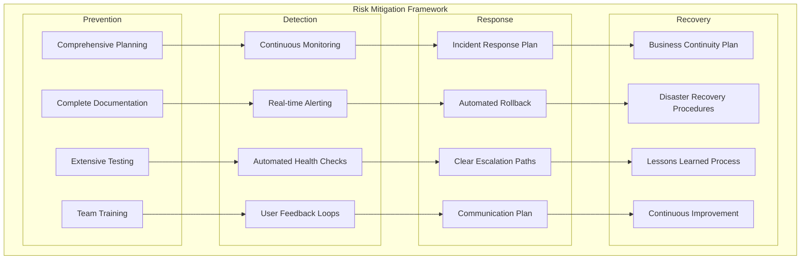

---

## 13. Conclusion

### 13.1 Architecture Benefits

The proposed ARM to ASO migration architecture provides significant benefits:

#### Technical Benefits
- **Unified Platform**: Kubernetes-native infrastructure and application management
- **GitOps Integration**: Declarative infrastructure with full audit trail
- **Enhanced Security**: Zero-trust architecture with workload identity
- **Operational Efficiency**: Automated reconciliation and drift detection
- **Cost Optimization**: Node Auto Provisioning and intelligent resource management

#### Business Benefits
- **Increased Agility**: Faster infrastructure provisioning and changes
- **Reduced Risk**: Comprehensive testing and rollback capabilities
- **Improved Compliance**: Automated policy enforcement and audit trails
- **Cost Reduction**: Optimized resource utilization and operational efficiency
- **Enhanced Security**: Modern security controls and monitoring

### 13.2 Critical Success Factors

1. **Executive Sponsorship**: Strong leadership support for transformation
2. **Team Collaboration**: Effective coordination across all teams
3. **Phased Approach**: Careful, measured migration reducing risk
4. **Comprehensive Testing**: Thorough validation at each phase
5. **Continuous Monitoring**: Real-time visibility and alerting

### 13.3 Next Steps

1. **Architecture Review**: Stakeholder review and approval
2. **Detailed Design**: Create detailed technical specifications
3. **Proof of Concept**: Validate key architectural components
4. **Team Preparation**: Training and capability building
5. **Implementation Planning**: Detailed project planning and resource allocation

This architecture document serves as the foundation for the implementation phase and provides the technical guidance for the Scrum team to create detailed implementation tickets.

---

### Document Approval

| Role | Name | Signature | Date |
|------|------|-----------|------|
| **Principal Architect** | | | |
| **Security Architect** | | | |
| **Network Architect** | | | |
| **Platform Engineering Lead** | | | |
| **DevOps Manager** | | | |

---

*This architecture document is controlled and versioned. All changes must be approved through the formal architecture review process.*