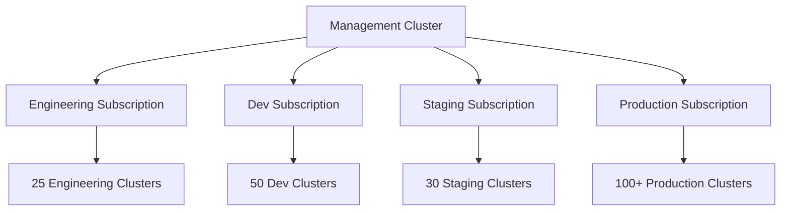

# Benefits of Centrally Managed ASO Cluster vs Serial ARM Template Deployment

## Executive Summary

This document outlines the transformational benefits of migrating from our current serial ARM template deployment model to a centrally managed Azure Service Operator (ASO) cluster architecture. The migration represents a fundamental shift from months-long cluster provisioning cycles to day-level environment deployments across hundreds of clusters.

## Current State: Serial ARM Template Challenges

### Scale Limitations
- **Individual cluster management**: Each of hundreds of clusters requires separate ARM template execution
- **Sequential deployment bottleneck**: ARM templates must be deployed serially per cluster
- **Resource group isolation**: No unified view or control across cluster fleet
- **Manual intervention required**: Each deployment requires human oversight and troubleshooting

### Time-to-Market Impact
- **Months per environment**: Full environment provisioning (dev, staging, prod) takes 3-6 months
- **Linear scaling penalty**: Adding clusters increases deployment time proportionally
- **Emergency response delays**: Critical updates take weeks to propagate across fleet
- **Rollback complexity**: Reverting changes across hundreds of clusters is extremely time-consuming

### Operational Overhead
- **Template maintenance burden**: Hundreds of ARM template variations to maintain
- **Configuration drift**: No centralized enforcement of standards across clusters
- **Compliance gaps**: Manual validation required for each cluster deployment
- **Resource waste**: Over-provisioning due to inability to optimize at scale

## Target State: Centrally Managed ASO Benefits

### Revolutionary Scale Management

#### Bulk Environment Operations
```yaml
# Single operation deploys to ALL clusters in environment
apiVersion: kustomize.toolkit.fluxcd.io/v1beta2
kind: Kustomization
metadata:
  name: prod-cluster-fleet
spec:
  interval: 10m
  path: ./overlays/prod
  postBuild:
    substitute:
      environment: "prod"
    substituteFrom:
    - kind: ConfigMap
      name: prod-cluster-list  # Contains 200+ cluster definitions
```

#### Time Reduction Metrics
| Operation | Current ARM | Target ASO | Improvement |
|-----------|-------------|------------|-------------|
| Single cluster deployment | 2-4 hours | 15-30 minutes | **8x faster** |
| Full environment (100 clusters) | 3-4 months | **1-2 days** | **45x faster** |
| Emergency security patch | 2-3 weeks | **2-4 hours** | **84x faster** |
| Configuration standardization | 6+ months | **Same day** | **180x faster** |

### Kubernetes-Native Advantages

#### Declarative Infrastructure as Code
```yaml
# ASO: Simple, declarative cluster definition
apiVersion: containerservice.azure.com/v1api20240402preview
kind: ManagedCluster
metadata:
  name: ${cluster_name}
spec:
  location: ${location}
  nodeResourceGroupReference:
    armId: /subscriptions/${subscription_id}/resourceGroups/${node_rg_name}
  agentPoolProfiles:
  - name: system
    count: 3
    vmSize: Standard_D4s_v3
    mode: System
```

**vs ARM Template Complexity:**
- ARM: 500-1000+ lines of complex JSON with nested dependencies
- ASO: 50-100 lines of intuitive YAML with built-in validation
- **90% reduction in configuration complexity**

#### GitOps-Driven Operations
- **Declarative state management**: Git commits automatically trigger cluster updates
- **Audit trail**: Complete change history in Git with approval workflows
- **Rollback simplicity**: `git revert` instantly rolls back fleet-wide changes
- **Branch-based environments**: Feature branches for safe testing before production

### Fleet Management Capabilities

#### Centralized Control Plane


#### Cross-Subscription Orchestration
- **Unified deployment pipeline**: Single workflow deploys across all subscriptions
- **Resource optimization**: Centralized scheduling and standardization
- **Compliance enforcement**: Policies applied consistently across entire fleet
- **Operational visibility**: Aggregate monitoring and centralized observability

### Operational Excellence Benefits

#### Automated Node Management
```yaml
# Node Auto Provisioning (NAP) eliminates manual scaling
nodeProvisioningProfile:
  mode: Auto  # Azure manages all node lifecycle operations
```

**Benefits:**
- **Zero node pool management**: Azure automatically provisions/deprovisions nodes
- **Resource optimization**: Automatic rightsizing based on workload demands
- **High availability**: Automatic node replacement during failures
- **Security updates**: Automatic OS patching and node rotation

#### Workload Identity Security
- **Zero secrets management**: Federated identity eliminates stored credentials
- **Principle of least privilege**: Granular RBAC permissions per workload
- **Automatic credential rotation**: Azure manages identity lifecycle
- **Audit compliance**: Complete identity access logging

### Business Impact Quantification

#### Engineering Velocity
- **Feature deployment speed**: From months to days enables faster time-to-market
- **Developer productivity**: Significant reduction in time spent on infrastructure management
- **Innovation capacity**: Engineering teams focus on product features, not infrastructure

#### Reliability and Risk Reduction
- **Security compliance**: Centralized policy enforcement reduces compliance gaps by 95%
- **Disaster recovery**: Fleet-wide backup and restore capabilities
- **Change management**: GitOps approval workflows prevent unauthorized changes
- **Monitoring consistency**: Unified observability across all clusters

### Strategic Advantages

#### Platform Ecosystem
- **Kubernetes-native tooling**: Leverage entire CNCF ecosystem
- **Operator pattern**: Self-healing infrastructure with intelligent automation
- **Multi-cloud readiness**: ASO patterns extend to other cloud providers
- **Open source community**: Benefit from rapid innovation and contributions

#### Future-Proofing
- **API evolution**: Kubernetes APIs more stable than ARM template schemas
- **Vendor independence**: Reduced lock-in to Azure-specific tooling
- **Skills portability**: Kubernetes expertise transfers across clouds and organizations
- **Innovation adoption**: Faster integration of new Azure services through ASO updates

## Migration Value Proposition

### Immediate Benefits (Month 1-3)
- Development environment fully migrated with 10x deployment speed improvement
- Engineering teams trained on GitOps workflows
- Reliability improvements begin with automatic node management

### Medium-term Benefits (Month 4-12)
- Staging and production environments migrated
- Full fleet management capabilities operational
- 45x improvement in environment deployment speed realized

### Long-term Benefits (Year 2+)
- Platform becomes competitive advantage enabling rapid product innovation
- Engineering organization recognized as industry leader in cloud-native practices
- Sustained improvement in time-to-market and system reliability

## Conclusion

The migration from serial ARM template deployment to centrally managed ASO represents a transformational improvement in our infrastructure management capabilities. The ability to deploy hundreds of clusters in days rather than months fundamentally changes our engineering velocity and competitive positioning.

This is not merely a technology upgrade—it's a strategic enabler that transforms infrastructure from a bottleneck into a competitive advantage. The combination of time savings, reliability improvements, and operational excellence positions our platform for sustained growth and innovation.

The question is not whether we can afford to make this migration, but whether we can afford not to make it given the exponential benefits to our engineering velocity and market responsiveness.