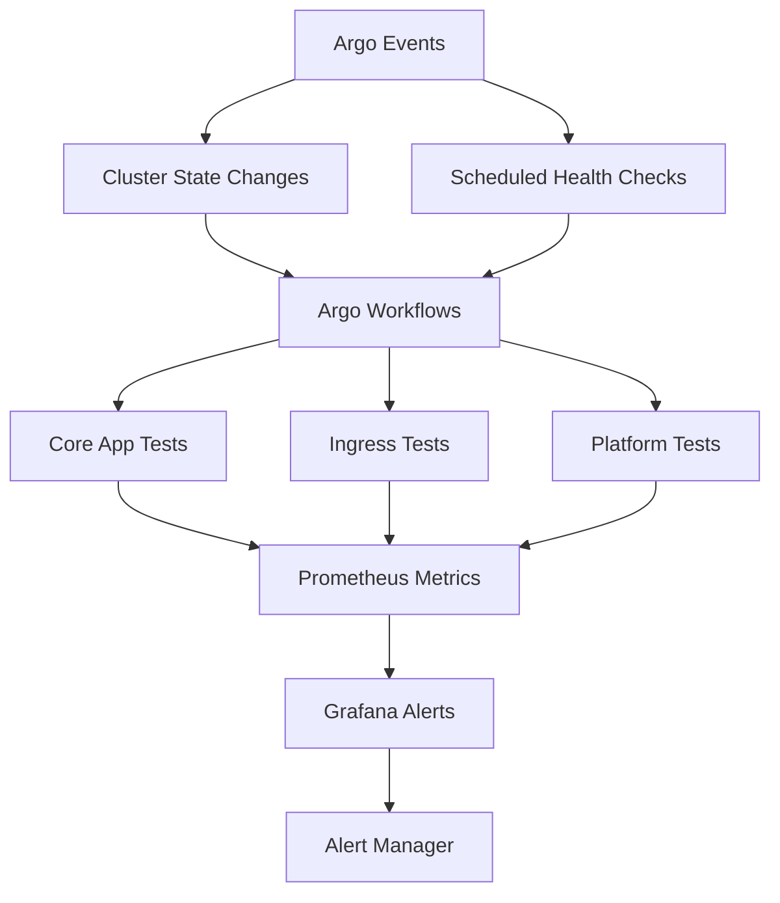

# Platform Testing Strategy with Argo Workflows and Argo Events

## Overview

This document outlines a comprehensive testing strategy for our ASO-managed platform using Argo Workflows for test orchestration and Argo Events for reactive testing. The strategy ensures operational readiness across hundreds of clusters with automated validation of core platform components and ingress functionality.

## Testing Architecture



## Core Platform Components Testing

### Essential Applications Validation

The platform testing validates these critical components across all clusters:

#### Core Infrastructure Apps
- **cert-manager**: TLS certificate provisioning and renewal
- **external-dns**: DNS record management for ingress
- **external-secrets**: Secret synchronization from Azure Key Vault
- **nginx-ingress**: Ingress controller functionality
- **cluster-autoscaler**: Node scaling operations
- **azure-workload-identity**: Pod identity authentication

#### Monitoring and Observability
- **prometheus**: Metrics collection and storage
- **grafana**: Dashboard and alerting functionality
- **loki**: Log aggregation and querying
- **jaeger**: Distributed tracing

## Argo Workflows Test Definitions

### Core Application Health Check Workflow

```yaml
apiVersion: argoproj.io/v1alpha1
kind: WorkflowTemplate
metadata:
  name: platform-health-check
  namespace: argo
spec:
  entrypoint: platform-tests
  templates:
  - name: platform-tests
    dag:
      tasks:
      - name: cert-manager-test
        template: cert-manager-health
      - name: external-dns-test
        template: external-dns-health
      - name: external-secrets-test
        template: external-secrets-health
      - name: ingress-test
        template: ingress-health
        dependencies: [cert-manager-test]
      - name: platform-app-test
        template: platform-app-health
        dependencies: [ingress-test]

  - name: cert-manager-health
    script:
      image: curlimages/curl:latest
      command: [sh]
      source: |
        # Check cert-manager API availability
        kubectl get certificaterequests -A --field-selector=status.phase=Ready
        if [ $? -eq 0 ]; then
          echo "cert-manager: HEALTHY"
          exit 0
        else
          echo "cert-manager: UNHEALTHY"
          exit 1
        fi

  - name: external-dns-health
    script:
      image: curlimages/curl:latest
      command: [sh]
      source: |
        # Check external-dns pod status
        kubectl get pods -n external-dns-system -l app.kubernetes.io/name=external-dns --field-selector=status.phase=Running
        if [ $? -eq 0 ]; then
          echo "external-dns: HEALTHY"
          exit 0
        else
          echo "external-dns: UNHEALTHY"
          exit 1
        fi

  - name: external-secrets-health
    script:
      image: curlimages/curl:latest
      command: [sh]
      source: |
        # Check external-secrets operator
        kubectl get pods -n external-secrets-system -l app.kubernetes.io/name=external-secrets --field-selector=status.phase=Running
        if [ $? -eq 0 ]; then
          echo "external-secrets: HEALTHY"
          exit 0
        else
          echo "external-secrets: UNHEALTHY"
          exit 1
        fi

  - name: ingress-health
    script:
      image: curlimages/curl:latest
      command: [sh]
      source: |
        # Check ingress controller
        kubectl get pods -n ingress-nginx -l app.kubernetes.io/component=controller --field-selector=status.phase=Running
        if [ $? -eq 0 ]; then
          echo "ingress-controller: HEALTHY"
          exit 0
        else
          echo "ingress-controller: UNHEALTHY"
          exit 1
        fi

  - name: platform-app-health
    script:
      image: curlimages/curl:latest
      command: [sh]
      source: |
        # Test platform test app via ingress
        response=$(curl -s -o /dev/null -w "%{http_code}" https://platform-test.${CLUSTER_DOMAIN}/health)
        if [ "$response" = "200" ]; then
          echo "platform-test-app: HEALTHY"
          exit 0
        else
          echo "platform-test-app: UNHEALTHY (HTTP $response)"
          exit 1
        fi
```

### Ingress Functionality Test

```yaml
apiVersion: argoproj.io/v1alpha1
kind: WorkflowTemplate
metadata:
  name: ingress-functionality-test
  namespace: argo
spec:
  entrypoint: ingress-tests
  templates:
  - name: ingress-tests
    dag:
      tasks:
      - name: deploy-test-app
        template: deploy-test-application
      - name: test-http-ingress
        template: test-http-endpoint
        dependencies: [deploy-test-app]
      - name: test-https-ingress
        template: test-https-endpoint
        dependencies: [deploy-test-app]
      - name: test-dns-resolution
        template: test-dns-resolution
        dependencies: [deploy-test-app]
      - name: cleanup-test-app
        template: cleanup-test-application
        dependencies: [test-http-ingress, test-https-ingress, test-dns-resolution]

  - name: deploy-test-application
    resource:
      action: apply
      manifest: |
        apiVersion: apps/v1
        kind: Deployment
        metadata:
          name: platform-test-app
          namespace: platform-tests
        spec:
          replicas: 1
          selector:
            matchLabels:
              app: platform-test-app
          template:
            metadata:
              labels:
                app: platform-test-app
            spec:
              containers:
              - name: nginx
                image: nginx:alpine
                ports:
                - containerPort: 80
                resources:
                  requests:
                    cpu: 10m
                    memory: 16Mi
        ---
        apiVersion: v1
        kind: Service
        metadata:
          name: platform-test-app
          namespace: platform-tests
        spec:
          selector:
            app: platform-test-app
          ports:
          - port: 80
            targetPort: 80
        ---
        apiVersion: networking.k8s.io/v1
        kind: Ingress
        metadata:
          name: platform-test-app
          namespace: platform-tests
          annotations:
            cert-manager.io/cluster-issuer: letsencrypt-prod
            nginx.ingress.kubernetes.io/rewrite-target: /
        spec:
          ingressClassName: nginx
          tls:
          - hosts:
            - platform-test.${CLUSTER_DOMAIN}
            secretName: platform-test-tls
          rules:
          - host: platform-test.${CLUSTER_DOMAIN}
            http:
              paths:
              - path: /
                pathType: Prefix
                backend:
                  service:
                    name: platform-test-app
                    port:
                      number: 80

  - name: test-http-endpoint
    script:
      image: curlimages/curl:latest
      command: [sh]
      source: |
        sleep 30  # Wait for ingress to be ready
        response=$(curl -s -o /dev/null -w "%{http_code}" http://platform-test.${CLUSTER_DOMAIN})
        if [ "$response" = "200" ] || [ "$response" = "301" ] || [ "$response" = "302" ]; then
          echo "HTTP ingress: WORKING"
          exit 0
        else
          echo "HTTP ingress: FAILED (HTTP $response)"
          exit 1
        fi

  - name: test-https-endpoint
    script:
      image: curlimages/curl:latest
      command: [sh]
      source: |
        sleep 60  # Wait for cert-manager to provision certificate
        response=$(curl -s -o /dev/null -w "%{http_code}" https://platform-test.${CLUSTER_DOMAIN})
        if [ "$response" = "200" ]; then
          echo "HTTPS ingress: WORKING"
          exit 0
        else
          echo "HTTPS ingress: FAILED (HTTP $response)"
          exit 1
        fi

  - name: test-dns-resolution
    script:
      image: curlimages/curl:latest
      command: [sh]
      source: |
        nslookup platform-test.${CLUSTER_DOMAIN}
        if [ $? -eq 0 ]; then
          echo "DNS resolution: WORKING"
          exit 0
        else
          echo "DNS resolution: FAILED"
          exit 1
        fi

  - name: cleanup-test-application
    resource:
      action: delete
      manifest: |
        apiVersion: apps/v1
        kind: Deployment
        metadata:
          name: platform-test-app
          namespace: platform-tests
        ---
        apiVersion: v1
        kind: Service
        metadata:
          name: platform-test-app
          namespace: platform-tests
        ---
        apiVersion: networking.k8s.io/v1
        kind: Ingress
        metadata:
          name: platform-test-app
          namespace: platform-tests
```

## Argo Events Integration

### Event Sources for Reactive Testing

```yaml
apiVersion: argoproj.io/v1alpha1
kind: EventSource
metadata:
  name: platform-events
  namespace: argo-events
spec:
  webhook:
    cluster-ready:
      port: "12000"
      endpoint: /cluster-ready
      method: POST
  resource:
    cluster-state:
      namespace: kube-system
      group: ""
      version: v1
      resource: nodes
      eventTypes:
        - ADD
        - UPDATE
        - DELETE
    pod-failures:
      namespace: ""
      group: ""
      version: v1
      resource: pods
      eventTypes:
        - UPDATE
      filter:
        fields:
          - key: status.phase
            operation: "=="
            value: "Failed"
```

### Event Triggers for Automated Testing

```yaml
apiVersion: argoproj.io/v1alpha1
kind: Sensor
metadata:
  name: platform-test-triggers
  namespace: argo-events
spec:
  template:
    serviceAccountName: argo-events-sa
  dependencies:
    - name: cluster-ready
      eventSourceName: platform-events
      eventName: cluster-ready
    - name: node-changes
      eventSourceName: platform-events
      eventName: cluster-state
    - name: pod-failures
      eventSourceName: platform-events
      eventName: pod-failures
  triggers:
    - template:
        name: run-health-check
        conditions: cluster-ready
        argoWorkflow:
          group: argoproj.io
          version: v1alpha1
          resource: workflows
          operation: submit
          source:
            resource:
              apiVersion: argoproj.io/v1alpha1
              kind: Workflow
              metadata:
                generateName: platform-health-
                namespace: argo
              spec:
                workflowTemplateRef:
                  name: platform-health-check
                arguments:
                  parameters:
                  - name: cluster-name
                    value: "{{.Input.cluster-name}}"
    - template:
        name: run-ingress-test
        conditions: cluster-ready
        argoWorkflow:
          group: argoproj.io
          version: v1alpha1
          resource: workflows
          operation: submit
          source:
            resource:
              apiVersion: argoproj.io/v1alpha1
              kind: Workflow
              metadata:
                generateName: ingress-test-
                namespace: argo
              spec:
                workflowTemplateRef:
                  name: ingress-functionality-test
                arguments:
                  parameters:
                  - name: cluster-domain
                    value: "{{.Input.cluster-domain}}"
```

## Monitoring and Alerting Integration

### Prometheus Metrics for Test Results

```yaml
# ServiceMonitor for Argo Workflows metrics
apiVersion: monitoring.coreos.com/v1
kind: ServiceMonitor
metadata:
  name: argo-workflows-tests
  namespace: monitoring
spec:
  selector:
    matchLabels:
      app.kubernetes.io/name: argo-workflows-server
  endpoints:
  - port: metrics
    interval: 30s
    path: /metrics
```

### Grafana Dashboard Queries

```promql
# Platform health test success rate
rate(argo_workflow_status_total{name=~"platform-health.*",phase="Succeeded"}[5m]) /
rate(argo_workflow_status_total{name=~"platform-health.*"}[5m]) * 100

# Ingress test failure rate
rate(argo_workflow_status_total{name=~"ingress-test.*",phase="Failed"}[5m])

# Average test execution time
avg(argo_workflow_duration_seconds{name=~"platform-.*"})

# Core application health status
up{job=~"cert-manager|external-dns|external-secrets"}
```

### Alert Manager Rules

```yaml
groups:
- name: platform-testing
  rules:
  - alert: PlatformHealthTestsFailing
    expr: rate(argo_workflow_status_total{name=~"platform-health.*",phase="Failed"}[10m]) > 0
    for: 5m
    labels:
      severity: critical
      team: platform
    annotations:
      summary: "Platform health tests are failing"
      description: "Health tests for core platform components are failing in cluster {{ $labels.cluster }}"

  - alert: IngressTestsFailing
    expr: rate(argo_workflow_status_total{name=~"ingress-test.*",phase="Failed"}[10m]) > 0
    for: 5m
    labels:
      severity: critical
      team: platform
    annotations:
      summary: "Ingress functionality tests are failing"
      description: "Ingress tests are failing in cluster {{ $labels.cluster }}"

  - alert: CoreApplicationDown
    expr: up{job=~"cert-manager|external-dns|external-secrets"} == 0
    for: 2m
    labels:
      severity: critical
      team: platform
    annotations:
      summary: "Core platform application is down"
      description: "{{ $labels.job }} is not responding in cluster {{ $labels.cluster }}"
```

## Scheduled Testing Strategy

### Continuous Health Monitoring

```yaml
apiVersion: argoproj.io/v1alpha1
kind: CronWorkflow
metadata:
  name: scheduled-platform-tests
  namespace: argo
spec:
  schedule: "*/15 * * * *"  # Every 15 minutes
  workflowSpec:
    entrypoint: platform-health-check
    workflowTemplateRef:
      name: platform-health-check
  successfulJobsHistoryLimit: 3
  failedJobsHistoryLimit: 1
```

### Deep Ingress Testing

```yaml
apiVersion: argoproj.io/v1alpha1
kind: CronWorkflow
metadata:
  name: scheduled-ingress-tests
  namespace: argo
spec:
  schedule: "0 */2 * * *"  # Every 2 hours
  workflowSpec:
    entrypoint: ingress-functionality-test
    workflowTemplateRef:
      name: ingress-functionality-test
  successfulJobsHistoryLimit: 3
  failedJobsHistoryLimit: 1
```

## Fleet-Wide Testing Orchestration

### Multi-Cluster Test Coordination

```yaml
apiVersion: argoproj.io/v1alpha1
kind: WorkflowTemplate
metadata:
  name: fleet-wide-health-check
  namespace: argo
spec:
  entrypoint: fleet-tests
  templates:
  - name: fleet-tests
    steps:
    - - name: test-dev-clusters
        template: cluster-group-test
        arguments:
          parameters:
          - name: cluster-group
            value: "dev"
    - - name: test-staging-clusters
        template: cluster-group-test
        arguments:
          parameters:
          - name: cluster-group
            value: "staging"
    - - name: test-prod-clusters
        template: cluster-group-test
        arguments:
          parameters:
          - name: cluster-group
            value: "prod"

  - name: cluster-group-test
    inputs:
      parameters:
      - name: cluster-group
    script:
      image: kubectl:latest
      command: [sh]
      source: |
        # Get all clusters in the specified group
        clusters=$(kubectl get clusters -l environment={{inputs.parameters.cluster-group}} -o jsonpath='{.items[*].metadata.name}')

        for cluster in $clusters; do
          echo "Testing cluster: $cluster"
          # Submit workflow for each cluster
          argo submit platform-health-check --parameter cluster-name=$cluster
        done
```

## Testing Validation Criteria

### Core Application Health Checks
- **cert-manager**: Certificate issuance within 5 minutes
- **external-dns**: DNS record creation within 2 minutes
- **external-secrets**: Secret sync from Key Vault within 1 minute
- **ingress-controller**: HTTP response within 30 seconds

### Ingress Functionality Validation
- **HTTP endpoint**: 200 response code
- **HTTPS endpoint**: Valid TLS certificate and 200 response
- **DNS resolution**: Successful lookup of test domain
- **Load balancer**: Proper traffic distribution

### Performance Thresholds
- **Test execution time**: < 5 minutes for health checks
- **Ingress test time**: < 10 minutes including certificate provisioning
- **Resource usage**: < 100m CPU, < 128Mi memory per test

## Implementation Roadmap

### Phase 1: Core Testing Framework (Sprint 1-2)
- Deploy Argo Workflows and Argo Events
- Implement basic health check workflows
- Configure Prometheus metrics collection

### Phase 2: Ingress Testing (Sprint 3-4)
- Implement comprehensive ingress testing
- Configure cert-manager validation
- Set up DNS resolution testing

### Phase 3: Fleet-Wide Orchestration (Sprint 5-6)
- Implement multi-cluster test coordination
- Configure event-driven testing
- Set up Grafana dashboards and alerting

### Phase 4: Advanced Scenarios (Sprint 7-8)
- Chaos engineering integration
- Performance benchmarking
- Disaster recovery testing

This testing strategy ensures that our ASO-managed platform maintains operational excellence across hundreds of clusters with automated validation, proactive alerting, and comprehensive observability through our existing Prometheus and Grafana stack.