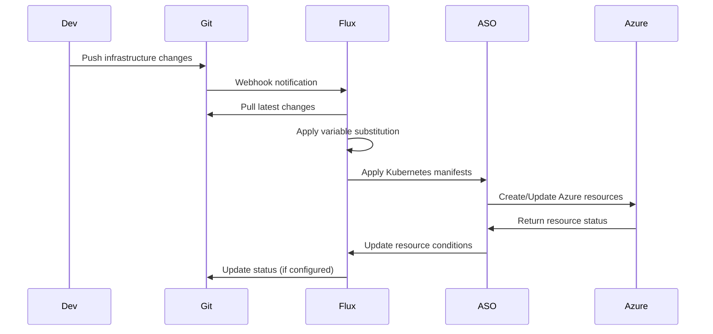

# Story 1.12: Flux and ASO Integration

<!-- Powered by BMAD™ Core -->

## Status
Draft

## Story
**As a** Platform Engineer,
**I want** to integrate Flux with ASO manifests,
**So that** infrastructure changes are deployed via GitOps.

## Acceptance Criteria
1. ASO CRDs committed to Git repository
2. Flux Kustomization pointing to ASO manifests
3. Successful reconciliation of ASO resources
4. Git commit triggers infrastructure changes
5. Rollback capability tested

## Tasks / Subtasks
- [ ] Commit ASO CRD templates to Git repository (AC: 1)
  - [ ] Organize ASO templates in proper directory structure
  - [ ] Commit base templates with variable placeholders
  - [ ] Include environment-specific overlays
  - [ ] Tag and version initial template set
- [ ] Create Flux Kustomization for ASO resources (AC: 2)
  - [ ] Configure Kustomization to monitor ASO directories
  - [ ] Set up proper health checks for ASO resources
  - [ ] Configure resource dependencies and ordering
  - [ ] Set reconciliation intervals and retry policies
- [ ] Configure Flux to monitor infrastructure directories (AC: 2, 3)
  - [ ] Set up GitRepository source for infrastructure
  - [ ] Configure directory monitoring and change detection
  - [ ] Test automatic sync on Git commits
  - [ ] Validate resource status propagation
- [ ] Test end-to-end Git-to-Azure provisioning (AC: 3, 4)
  - [ ] Create test resource in Git repository
  - [ ] Monitor Flux reconciliation process
  - [ ] Validate resource creation in Azure
  - [ ] Test status updates and condition reporting
- [ ] Implement and test rollback procedures (AC: 5)
  - [ ] Test Git revert and rollback scenarios
  - [ ] Validate automatic resource cleanup
  - [ ] Test manual intervention procedures
  - [ ] Document rollback playbooks
- [ ] Create deployment status monitoring (AC: 3, 4, 5)
  - [ ] Set up monitoring for Flux reconciliation
  - [ ] Monitor ASO resource creation status
  - [ ] Create alerts for deployment failures
  - [ ] Set up deployment success notifications

## Dev Notes

### Previous Story Dependencies
This story builds on:
- Story 1.10 (Variable Substitution): Variable substitution must be working
- Story 1.11 (Repository Structure): Repository structure must be established
- Story 1.7 (ASO CRD Templates): ASO templates must be created

### GitOps Integration Architecture
**Git-to-Azure Integration Flow** [Source: architecture.md#gitops-integration-pattern]:


### Flux Kustomization Configuration
**ASO Resource Kustomization**:
```yaml
apiVersion: kustomize.toolkit.fluxcd.io/v1
kind: Kustomization
metadata:
  name: aso-infrastructure
  namespace: flux-system
spec:
  interval: 5m
  path: "./environments/${ENVIRONMENT}"
  prune: true
  sourceRef:
    kind: GitRepository
    name: infrastructure
  timeout: 30m
  validation: client
  postBuild:
    substitute:
      ENVIRONMENT: "${ENVIRONMENT}"
    substituteFrom:
      - kind: ConfigMap
        name: environment-variables
      - kind: Secret
        name: sensitive-variables
  healthChecks:
    - apiVersion: resources.azure.com/v1api20200601
      kind: ResourceGroup
      name: "${ENVIRONMENT}-workloads-rg-001"
    - apiVersion: containerservice.azure.com/v1api20240402preview
      kind: ManagedCluster
      name: "${ENVIRONMENT}-workloads-aks-001"
  dependsOn:
    - name: aso-base
```

**Base ASO Resources Kustomization**:
```yaml
apiVersion: kustomize.toolkit.fluxcd.io/v1
kind: Kustomization
metadata:
  name: aso-base
  namespace: flux-system
spec:
  interval: 10m
  path: "./platform/azure-service-operator/base"
  prune: true
  sourceRef:
    kind: GitRepository
    name: infrastructure
  healthChecks:
    - apiVersion: apps/v1
      kind: Deployment
      name: azure-service-operator-controller-manager
      namespace: azure-service-operator-system
```

### Health Check Configuration
**ASO Resource Health Checks**:
```yaml
healthChecks:
  # Resource Group health
  - apiVersion: resources.azure.com/v1api20200601
    kind: ResourceGroup
    name: "${ENVIRONMENT}-workloads-rg-001"
    namespace: azure-service-operator-system

  # AKS Cluster health
  - apiVersion: containerservice.azure.com/v1api20240402preview
    kind: ManagedCluster
    name: "${ENVIRONMENT}-workloads-aks-001"
    namespace: azure-service-operator-system

  # Identity resources health
  - apiVersion: managedidentity.azure.com/v1api20230131
    kind: UserAssignedIdentity
    name: "${ENVIRONMENT}-workloads-identity-001"
    namespace: azure-service-operator-system

  # Network resources health
  - apiVersion: network.azure.com/v1api20201101
    kind: VirtualNetwork
    name: "${ENVIRONMENT}-workloads-vnet-001"
    namespace: azure-service-operator-system
```

### Resource Dependencies
**Deployment Order Management**:
```yaml
# 1. Base infrastructure (ResourceGroup, Identity)
apiVersion: kustomize.toolkit.fluxcd.io/v1
kind: Kustomization
metadata:
  name: aso-foundation
spec:
  path: "./environments/${ENVIRONMENT}/foundation"
  # No dependencies - runs first

---
# 2. Network infrastructure
apiVersion: kustomize.toolkit.fluxcd.io/v1
kind: Kustomization
metadata:
  name: aso-network
spec:
  path: "./environments/${ENVIRONMENT}/network"
  dependsOn:
    - name: aso-foundation

---
# 3. Compute infrastructure
apiVersion: kustomize.toolkit.fluxcd.io/v1
kind: Kustomization
metadata:
  name: aso-compute
spec:
  path: "./environments/${ENVIRONMENT}/compute"
  dependsOn:
    - name: aso-foundation
    - name: aso-network
```

### Monitoring and Alerting
**Deployment Status Monitoring**:
```yaml
# Prometheus Alert Rules
apiVersion: monitoring.coreos.com/v1
kind: PrometheusRule
metadata:
  name: flux-aso-integration-alerts
spec:
  groups:
    - name: flux-aso-integration
      rules:
        - alert: FluxKustomizationFailing
          expr: gotk_reconcile_condition{type="Ready",status="False"} == 1
          for: 5m
          labels:
            severity: warning
          annotations:
            summary: "Flux Kustomization failing"
            description: "Kustomization {{ $labels.name }} has been failing for 5 minutes"

        - alert: ASOResourceProvisioningFailed
          expr: azure_service_operator_reconcile_errors_total > 0
          for: 2m
          labels:
            severity: critical
          annotations:
            summary: "ASO resource provisioning failed"
            description: "ASO resource {{ $labels.resource }} provisioning failed"
```

### Git Repository Integration
**Repository Structure for ASO**:
```
infrastructure/
├── environments/
│   ├── development/
│   │   ├── foundation/
│   │   │   ├── resource-group.yaml
│   │   │   ├── user-assigned-identity.yaml
│   │   │   └── kustomization.yaml
│   │   ├── network/
│   │   │   ├── virtual-network.yaml
│   │   │   ├── network-security-group.yaml
│   │   │   └── kustomization.yaml
│   │   └── compute/
│   │       ├── managed-cluster.yaml
│   │       ├── node-pools.yaml
│   │       └── kustomization.yaml
│   ├── staging/
│   └── production/
```

### Rollback Procedures
**Automated Rollback Configuration**:
```bash
#!/bin/bash
# rollback-deployment.sh

ENVIRONMENT=$1
COMMIT_SHA=$2

echo "Rolling back $ENVIRONMENT to commit $COMMIT_SHA"

# Revert Git repository to previous state
git revert $COMMIT_SHA --no-edit

# Force Flux to reconcile immediately
flux reconcile kustomization aso-infrastructure-$ENVIRONMENT --with-source

# Monitor rollback status
kubectl wait --for=condition=Ready \
  kustomization/aso-infrastructure-$ENVIRONMENT \
  -n flux-system \
  --timeout=600s

echo "Rollback completed for $ENVIRONMENT"
```

### Testing Procedures
**End-to-End Testing Script**:
```bash
#!/bin/bash
# test-git-to-azure.sh

echo "Testing Git-to-Azure provisioning..."

# 1. Create test resource in Git
cat <<EOF > test-resource.yaml
apiVersion: resources.azure.com/v1api20200601
kind: ResourceGroup
metadata:
  name: flux-test-rg-001
spec:
  location: eastus
  tags:
    test: "flux-aso-integration"
    environment: "test"
EOF

# 2. Commit and push
git add test-resource.yaml
git commit -m "test: Add test resource group for Flux-ASO integration"
git push origin main

# 3. Wait for Flux reconciliation
echo "Waiting for Flux to reconcile..."
kubectl wait --for=condition=Ready \
  kustomization/aso-infrastructure \
  -n flux-system \
  --timeout=300s

# 4. Verify resource creation in cluster
kubectl get resourcegroup flux-test-rg-001 -o yaml

# 5. Verify resource exists in Azure
az group show --name flux-test-rg-001

# 6. Cleanup
git rm test-resource.yaml
git commit -m "test: Remove test resource group"
git push origin main

echo "Git-to-Azure test completed successfully"
```

## Testing

### Integration Testing
- Git commit to Azure resource provisioning workflow
- Variable substitution during deployment
- Resource dependency resolution and ordering
- Health check validation and status reporting

### Rollback Testing
- Git revert and automatic resource cleanup
- Manual rollback procedure validation
- Failed deployment recovery scenarios
- Data consistency during rollback operations

### Performance Testing
- Git-to-cluster synchronization timing
- Large-scale resource deployment performance
- Concurrent environment deployment testing
- Resource provisioning timeout handling

## Change Log
| Date | Version | Description | Author |
|------|---------|-------------|--------|
| 2025-01-19 | 1.0 | Initial story creation | Scrum Master |

## Dev Agent Record
*This section will be populated by the development agent during implementation*

## QA Results
*This section will be populated by the QA agent after story completion*