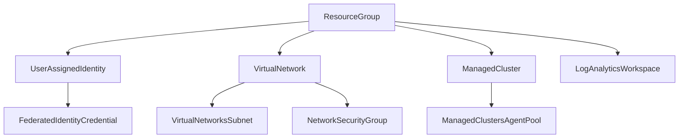

# Story 1.5: Azure Service Operator v2 Installation

<!-- Powered by BMAD™ Core -->

## Status
Draft

## Story
**As a** Platform Engineer,
**I want** to install Azure Service Operator v2 in the management cluster,
**So that** I can manage Azure resources using Kubernetes CRDs.

## Acceptance Criteria
1. ASO v2 latest stable version installed
2. All required CRDs deployed successfully
3. ASO controller pods running and healthy
4. Workload identity configured for ASO service account
5. Cross-subscription permissions validated

## Tasks / Subtasks
- [ ] Research and prepare ASO v2 installation (AC: 1)
  - [ ] Identify latest stable ASO v2 version (v2.8.0+)
  - [ ] Download and validate Helm chart or YAML manifests
  - [ ] Review installation requirements and dependencies
  - [ ] Plan installation approach (Helm vs direct YAML)
- [ ] Install ASO using chosen deployment method (AC: 1, 2, 3)
  - [ ] Create azure-service-operator-system namespace
  - [ ] Install ASO v2 using Helm chart or kubectl apply
  - [ ] Verify all CRDs are installed and ready
  - [ ] Validate ASO controller pods are running and healthy
  - [ ] Check ASO controller logs for any errors
- [ ] Configure workload identity for ASO service account (AC: 4)
  - [ ] Configure ASO service account with workload identity annotations
  - [ ] Create federated identity credentials linking service account to UAMI
  - [ ] Validate OIDC token exchange functionality
  - [ ] Test Azure authentication without using secrets
- [ ] Validate ASO can authenticate to Azure (AC: 4, 5)
  - [ ] Test ASO authentication to Azure ARM API
  - [ ] Verify access to all target subscriptions
  - [ ] Test resource provider access and registration
  - [ ] Validate cross-subscription resource management permissions
- [ ] Test basic resource provisioning (AC: 2, 3, 5)
  - [ ] Create test ResourceGroup using ASO CRD
  - [ ] Test UserAssignedIdentity creation
  - [ ] Validate resource status reporting and conditions
  - [ ] Test resource deletion and cleanup
  - [ ] Verify ASO reconciliation loops are working

## Dev Notes

### Previous Story Dependencies
This story builds on:
- Story 1.1 (Management Cluster Deployment): Provides the Kubernetes cluster
- Story 1.3 (Cross-Subscription RBAC): Provides UAMI and permissions
- Story 1.4 (Network Security Controls): Ensures secure cluster networking

### Azure Service Operator Configuration
**ASO v2 Technology Stack** [Source: architecture.md#azure-service-operator]:
```yaml
azure_service_operator:
  version: "v2.8.0+"
  api_versions:
    container_service: "v1api20240402preview"
    resources: "v1api20200601"
    managed_identity: "v1api20230131"
    network: "v1api20201101"
    insights: "v1api20230311"
    alerts_management: "v1api20230301"

  supported_resources:
    - "ResourceGroup"
    - "ManagedCluster"
    - "ManagedClustersAgentPool"
    - "UserAssignedIdentity"
    - "FederatedIdentityCredential"
    - "VirtualNetwork"
    - "VirtualNetworksSubnet"
    - "NetworkSecurityGroup"
    - "LogAnalyticsWorkspace"
    - "DataCollectionRule"
    - "PrometheusRuleGroup"
    - "ActionGroup"
```

### Workload Identity Integration
**Identity Configuration** [Source: architecture.md#security-architecture]:
- Service Account: `azureserviceoperator-default` in `azure-service-operator-system` namespace
- OIDC Issuer URL from management cluster
- Subject: `system:serviceaccount:azure-service-operator-system:azureserviceoperator-default`
- Audience: `api://AzureADTokenExchange`

**Federated Identity Credential**:
```yaml
apiVersion: managedidentity.azure.com/v1api20230131
kind: FederatedIdentityCredential
metadata:
  name: aso-workload-identity
spec:
  owner:
    name: aso-uami
  audiences:
    - api://AzureADTokenExchange
  issuer: <OIDC-ISSUER-URL>
  subject: system:serviceaccount:azure-service-operator-system:azureserviceoperator-default
```

### ASO Resource Hierarchy
**Resource Management Pattern** [Source: architecture.md#azure-service-operator-resource-hierarchy]:


### Installation Methods
**Helm Installation**:
```bash
helm repo add aso2 https://raw.githubusercontent.com/Azure/azure-service-operator/main/v2/charts
helm install aso2 aso2/azure-service-operator \
  --create-namespace \
  --namespace azure-service-operator-system \
  --set azureSubscriptionID=$AZURE_SUBSCRIPTION_ID \
  --set azureClientID=$AZURE_CLIENT_ID
```

**Direct YAML Installation**:
- Download official manifests from ASO releases
- Apply CRDs first, then controller manifests
- Configure service account with workload identity

### Cross-Subscription Configuration
**Multi-Subscription Management** [Source: architecture.md#cross-subscription-resource-model]:
- Management subscription: ASO controller location
- Network subscription: VNet and network resources
- Compute subscriptions: AKS clusters and node pools
- Monitoring subscription: Log Analytics and monitoring

### File Locations
**ASO Configuration Structure** [Source: folder-structure.md]:
- `eng/azureserviceoperator/managementcluster/` - Management cluster specific configs
- ASO CRDs and manifests deployed directly to cluster
- Configuration variables in ConfigMaps for cross-subscription targeting

### Monitoring and Observability
**ASO Controller Monitoring**:
- Controller pod health and resource utilization
- Azure API rate limiting and throttling metrics
- Resource reconciliation success/failure rates
- Cross-subscription authentication metrics

### Performance Considerations
**Resource Reconciliation**:
- ASO controller resource requests and limits
- Concurrent reconciliation settings
- Azure API rate limit handling
- Large-scale resource management optimization

## Testing

### Installation Validation
- ASO controller pod status and health checks
- CRD installation and schema validation
- Service account workload identity configuration
- Azure authentication and token exchange testing

### Functional Testing
- Basic resource provisioning (ResourceGroup creation)
- Cross-subscription resource management
- Resource status reporting and condition updates
- Resource deletion and cleanup verification

### Integration Testing
- RBAC permission validation across subscriptions
- Network connectivity from ASO to Azure APIs
- Error handling and retry mechanisms
- Reconciliation loop performance and stability

## Change Log
| Date | Version | Description | Author |
|------|---------|-------------|--------|
| 2025-01-19 | 1.0 | Initial story creation | Scrum Master |

## Dev Agent Record
*This section will be populated by the development agent during implementation*

### Agent Model Used
*To be filled by dev agent*

### Debug Log References
*To be filled by dev agent*

### Completion Notes List
*To be filled by dev agent*

### File List
*To be filled by dev agent*

## QA Results
*This section will be populated by the QA agent after story completion*