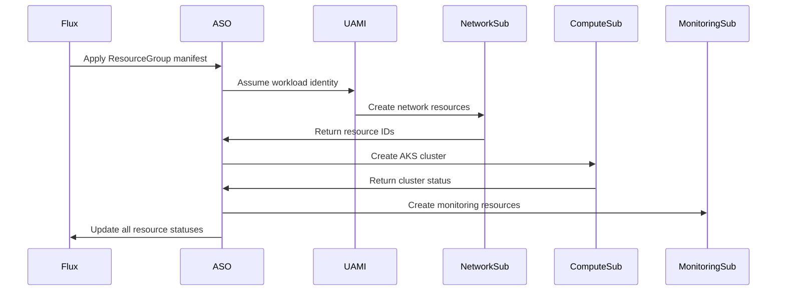

# Story 1.6: ASO Multi-Subscription Configuration

<!-- Powered by BMAD™ Core -->

## Status
Draft

## Story
**As a** Platform Engineer,
**I want** to configure ASO to work across multiple subscriptions,
**So that** I can provision resources in different environments.

## Acceptance Criteria
1. ASO configured with subscription targeting
2. Credential configuration for each subscription
3. Resource group provisioning tested in each subscription
4. Proper resource naming conventions implemented
5. Monitoring and logging configured

## Tasks / Subtasks
- [ ] Configure ASO subscription targeting (AC: 1)
  - [ ] Configure ASO controller for multi-subscription mode
  - [ ] Set up subscription-specific configuration maps
  - [ ] Configure default subscription targeting patterns
  - [ ] Test subscription targeting with sample resources
- [ ] Setup credential configuration per subscription (AC: 2)
  - [ ] Configure workload identity for cross-subscription access
  - [ ] Validate federated credentials across all subscriptions
  - [ ] Test authentication to each target subscription
  - [ ] Document credential management procedures
- [ ] Create test resource groups in each subscription (AC: 3)
  - [ ] Create test ResourceGroup in network subscription
  - [ ] Create test ResourceGroup in development subscription
  - [ ] Create test ResourceGroup in staging subscription
  - [ ] Create test ResourceGroup in production subscription
  - [ ] Verify resource group creation and status reporting
- [ ] Implement resource naming convention (AC: 4)
  - [ ] Define standardized naming convention for all resources
  - [ ] Implement environment-specific prefixes and suffixes
  - [ ] Configure resource tagging standards
  - [ ] Create naming validation and enforcement mechanisms
  - [ ] Document naming standards and examples
- [ ] Configure ASO controller monitoring (AC: 5)
  - [ ] Set up Prometheus metrics collection for ASO
  - [ ] Configure controller resource utilization monitoring
  - [ ] Create dashboards for ASO operational metrics
  - [ ] Set up alerting for ASO controller failures
  - [ ] Configure audit logging for all ASO operations
- [ ] Create troubleshooting runbook (AC: 1, 2, 3, 5)
  - [ ] Document common ASO configuration issues
  - [ ] Create troubleshooting procedures for cross-subscription access
  - [ ] Document authentication and authorization troubleshooting
  - [ ] Create operational runbook for ASO maintenance
  - [ ] Set up support escalation procedures

## Dev Notes

### Previous Story Dependencies
This story builds on:
- Story 1.5 (ASO Installation): ASO v2 must be installed and operational
- Story 1.3 (Cross-Subscription RBAC): RBAC permissions must be configured
- Story 1.4 (Network Security Controls): Network access must be established

### Multi-Subscription Architecture
**Subscription Layout** [Source: architecture.md#target-state-architecture]:
- Management Subscription: ASO controller and management cluster
- Network Subscription: Shared network infrastructure (10.0.0.0/16)
- Development Subscription: Development environment resources
- Staging Subscription: Staging environment resources
- Production Subscription: Production environment resources
- Monitoring Subscription: Centralized monitoring and logging

### ASO Configuration Patterns
**Cross-Subscription Resource Targeting**:
```yaml
apiVersion: resources.azure.com/v1api20200601
kind: ResourceGroup
metadata:
  name: network-shared-rg
  annotations:
    serviceoperator.azure.com/subscription-id: "<NETWORK-SUBSCRIPTION-ID>"
spec:
  location: eastus
  tags:
    environment: "shared"
    managed-by: "aso"
    subscription: "network"
```

**Environment-Specific Configuration Maps**:
```yaml
apiVersion: v1
kind: ConfigMap
metadata:
  name: aso-subscription-config
data:
  network-subscription: "00000000-0000-0000-0000-000000000000"
  dev-subscription: "11111111-1111-1111-1111-111111111111"
  staging-subscription: "22222222-2222-2222-2222-222222222222"
  prod-subscription: "33333333-3333-3333-3333-333333333333"
  monitoring-subscription: "44444444-4444-4444-4444-444444444444"
```

### Resource Naming Convention
**Standardized Naming Pattern**:
```yaml
resource_naming:
  pattern: "{environment}-{workload}-{resource-type}-{identifier}"
  examples:
    resource_groups: "mgmt-aso-rg-001"
    aks_clusters: "dev-workloads-aks-001"
    virtual_networks: "prod-hub-vnet-001"

  environment_prefixes:
    management: "mgmt"
    development: "dev"
    staging: "stg"
    production: "prod"
    network: "net"
    monitoring: "mon"

  resource_tags:
    mandatory:
      - "environment"
      - "managed-by"
      - "cost-center"
      - "owner"
    optional:
      - "application"
      - "version"
      - "backup-policy"
```

### Cross-Subscription Resource Flow
**Resource Provisioning Pattern** [Source: architecture.md#integration-patterns]:


### Monitoring and Observability
**ASO Controller Metrics** [Source: architecture.md#monitoring-architecture]:
```yaml
aso_monitoring:
  controller_metrics:
    - "aso_reconciliation_duration_seconds"
    - "aso_reconciliation_total"
    - "aso_resource_provisioning_time"
    - "aso_azure_api_rate_limits"
    - "aso_cross_subscription_access_errors"

  dashboards:
    - "ASO Operational Dashboard"
    - "Azure Resource Inventory"
    - "Cross-Subscription Performance"
    - "Cost Optimization Dashboard"

  alerts:
    critical:
      - "ASO Controller Pod Crash"
      - "Azure Authentication Failures"
      - "Cross-Subscription Access Denied"
    warning:
      - "High Azure API Rate Limiting"
      - "Resource Provisioning Delays"
      - "Reconciliation Loop Errors"
```

### File Locations
**Configuration Structure** [Source: folder-structure.md]:
```
eng/azureserviceoperator/managementcluster/
├── configmap/
│   ├── subscription-mapping.yaml
│   ├── naming-conventions.yaml
│   └── resource-defaults.yaml
├── identity/
│   ├── federated-credentials.yaml
│   └── subscription-rbac.yaml
└── monitoring/
    ├── aso-metrics.yaml
    └── aso-alerts.yaml
```

### Subscription-Specific Testing
**Test Resource Groups**:
- Network: `net-aso-test-rg-001`
- Development: `dev-aso-test-rg-001`
- Staging: `stg-aso-test-rg-001`
- Production: `prod-aso-test-rg-001`
- Monitoring: `mon-aso-test-rg-001`

Each test should verify:
- Resource creation success
- Proper naming convention compliance
- Tag application and compliance
- Status condition reporting
- Clean deletion capability

## Testing

### Multi-Subscription Validation
- Subscription targeting accuracy testing
- Cross-subscription authentication validation
- Resource provisioning in each subscription
- Naming convention enforcement testing
- Resource tagging compliance verification

### Monitoring and Alerting Testing
- ASO controller metrics collection verification
- Dashboard functionality and accuracy testing
- Alert threshold and notification testing
- Log aggregation and searchability testing

### Operational Testing
- ASO controller restart and recovery testing
- Azure API rate limiting handling
- Large-scale resource provisioning testing
- Error handling and retry mechanism validation

## Change Log
| Date | Version | Description | Author |
|------|---------|-------------|--------|
| 2025-01-19 | 1.0 | Initial story creation | Scrum Master |

## Dev Agent Record
*This section will be populated by the development agent during implementation*

### Agent Model Used
*To be filled by dev agent*

### Debug Log References
*To be filled by dev agent*

### Completion Notes List
*To be filled by dev agent*

### File List
*To be filled by dev agent*

## QA Results
*This section will be populated by the QA agent after story completion*