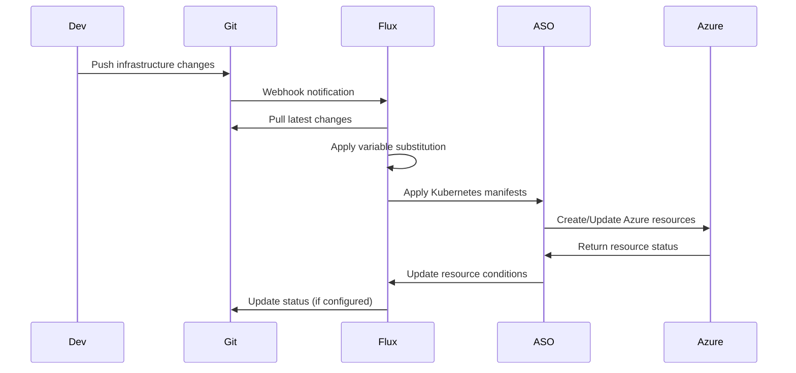

# Story 1.9: Flux v2 GitOps Installation

<!-- Powered by BMAD™ Core -->

## Status
Draft

## Story
**As a** Platform Engineer,
**I want** to install Flux v2 in the management cluster,
**So that** I can implement GitOps workflows for infrastructure.

## Acceptance Criteria
1. Flux v2 installed with all required controllers
2. Git repository integration configured
3. SSH key authentication setup
4. Flux monitoring and alerts configured
5. Basic reconciliation working

## Tasks / Subtasks
- [ ] Install Flux v2 using bootstrap command (AC: 1)
  - [ ] Install Flux CLI on management system
  - [ ] Bootstrap Flux v2 in management cluster
  - [ ] Verify all controllers are deployed and healthy
  - [ ] Configure Flux system namespace and RBAC
- [ ] Configure Git repository connection (AC: 2)
  - [ ] Set up Git repository integration (ADO/GitLab)
  - [ ] Configure repository structure for infrastructure code
  - [ ] Set up branch protection and policies
  - [ ] Test Git repository connectivity from cluster
- [ ] Setup SSH key for repository authentication (AC: 3)
  - [ ] Generate SSH key pair for Flux authentication
  - [ ] Configure SSH key in Git repository settings
  - [ ] Create Kubernetes secret with private SSH key
  - [ ] Test authenticated Git operations
- [ ] Configure Flux monitoring and notifications (AC: 4)
  - [ ] Set up Prometheus metrics collection for Flux
  - [ ] Configure notification channels (Slack, email)
  - [ ] Create alerts for Flux controller failures
  - [ ] Set up operational dashboards
- [ ] Test basic git-to-cluster synchronization (AC: 5)
  - [ ] Create test manifest in Git repository
  - [ ] Verify Flux detects and applies changes
  - [ ] Test reconciliation loop and drift detection
  - [ ] Validate status reporting and health checks
- [ ] Create Flux operational dashboard (AC: 4, 5)
  - [ ] Create Grafana dashboard for Flux operations
  - [ ] Monitor source controller synchronization
  - [ ] Track kustomize controller reconciliation
  - [ ] Set up notification controller metrics

## Dev Notes

### Previous Story Dependencies
This story builds on:
- Story 1.1 (Management Cluster): Provides the Kubernetes cluster
- Story 1.5 (ASO Installation): ASO must be ready for GitOps integration

### Flux v2 Architecture
**Flux Components** [Source: architecture.md#gitops-stack]:
```yaml
flux_gitops:
  version: "v2.2.0+"
  components:
    source_controller:
      git_repositories: true
      helm_repositories: true
      oci_repositories: true

    kustomize_controller:
      post_build_substitution: true
      health_checks: true
      dependency_management: true

    notification_controller:
      slack_integration: true
      email_notifications: true
      webhook_notifications: true

    image_automation_controller: false  # Not needed for infrastructure
    image_reflector_controller: false   # Not needed for infrastructure
```

### Git Repository Structure
**Infrastructure Repository Layout**:
```
infrastructure/
├── clusters/
│   └── management/
│       ├── flux-system/
│       └── applications/
├── platform/
│   └── azure-service-operator/
│       ├── base/
│       └── overlays/
└── environments/
    ├── development/
    ├── staging/
    └── production/
```

### Flux Bootstrap Installation
**Bootstrap Commands**:
```bash
# Install Flux CLI
curl -s https://fluxcd.io/install.sh | sudo bash

# Bootstrap Flux with Git repository
flux bootstrap git \
  --url=ssh://git@dev.azure.com/org/infrastructure \
  --branch=main \
  --path=clusters/management \
  --components-extra=image-reflector-controller,image-automation-controller \
  --read-write-key \
  --author-name="Platform Team" \
  --author-email="platform@company.com"
```

### Git Integration Configuration
**Git Repository Sources**:
```yaml
apiVersion: source.toolkit.fluxcd.io/v1
kind: GitRepository
metadata:
  name: infrastructure
  namespace: flux-system
spec:
  interval: 1m
  ref:
    branch: main
  secretRef:
    name: flux-system
  url: ssh://git@dev.azure.com/org/infrastructure
```

**SSH Authentication Secret**:
```yaml
apiVersion: v1
kind: Secret
metadata:
  name: flux-system
  namespace: flux-system
type: Opaque
data:
  identity: <base64-encoded-private-key>
  identity.pub: <base64-encoded-public-key>
  known_hosts: <base64-encoded-known-hosts>
```

### Kustomization Configuration
**Root Kustomization**:
```yaml
apiVersion: kustomize.toolkit.fluxcd.io/v1
kind: Kustomization
metadata:
  name: infrastructure
  namespace: flux-system
spec:
  interval: 10m
  path: "./platform"
  prune: true
  sourceRef:
    kind: GitRepository
    name: infrastructure
  validation: client
  healthChecks:
    - apiVersion: apps/v1
      kind: Deployment
      name: azure-service-operator-controller-manager
      namespace: azure-service-operator-system
```

### Monitoring and Alerting
**Flux Controller Metrics** [Source: architecture.md#observability-stack]:
```yaml
flux_monitoring:
  metrics:
    - "gotk_reconcile_duration_seconds"
    - "gotk_reconcile_condition"
    - "gotk_suspend_status"
    - "gotk_resource_inventory"

  alerts:
    critical:
      - "Flux Controller Down"
      - "Git Repository Unreachable"
      - "Reconciliation Failing"
    warning:
      - "Slow Reconciliation"
      - "Resource Drift Detected"
      - "Authentication Issues"
```

### Notification Configuration
**Slack Notifications**:
```yaml
apiVersion: notification.toolkit.fluxcd.io/v1beta1
kind: Provider
metadata:
  name: slack
  namespace: flux-system
spec:
  type: slack
  channel: platform-alerts
  secretRef:
    name: slack-webhook
---
apiVersion: notification.toolkit.fluxcd.io/v1beta1
kind: Alert
metadata:
  name: infrastructure-alerts
  namespace: flux-system
spec:
  providerRef:
    name: slack
  eventSeverity: info
  eventSources:
    - kind: GitRepository
      name: '*'
    - kind: Kustomization
      name: '*'
```

### GitOps Integration Pattern
**Git-to-Azure Flow** [Source: architecture.md#gitops-integration-pattern]:


### File Locations
**Flux Configuration Structure** [Source: folder-structure.md]:
```
eng/azureserviceoperator/managementcluster/flux/
├── git-repository.yaml
├── kustomization.yaml
├── notifications/
│   ├── providers.yaml
│   └── alerts.yaml
└── monitoring/
    ├── prometheus-rules.yaml
    └── grafana-dashboard.yaml
```

## Testing

### Installation Validation
- Flux controller pod health and resource utilization
- Git repository connectivity and authentication
- SSH key authentication and rotation testing
- Webhook and notification functionality testing

### GitOps Workflow Testing
- Git commit to cluster synchronization timing
- Reconciliation loop functionality and error handling
- Drift detection and correction validation
- Multi-repository and multi-branch support

### Integration Testing
- ASO and Flux integration validation
- Variable substitution mechanism testing
- Health check and dependency management
- Alert and notification delivery testing

## Change Log
| Date | Version | Description | Author |
|------|---------|-------------|--------|
| 2025-01-19 | 1.0 | Initial story creation | Scrum Master |

## Dev Agent Record
*This section will be populated by the development agent during implementation*

## QA Results
*This section will be populated by the QA agent after story completion*