# Story 2.4: Development Application Migration

<!-- Powered by BMAD™ Core -->

## Status
Draft

## Story
**As a** Development Team Lead,
**I want** to migrate development applications to the new cluster,
**So that** development teams can validate the new environment.

## Acceptance Criteria
1. Application manifests updated for new cluster
2. Persistent volume data migrated
3. Application configurations updated
4. DNS and ingress configurations updated
5. All applications operational on new cluster

## Tasks / Subtasks
- [ ] Update application manifests for new cluster (AC: 1)
  - [ ] Update Kubernetes manifests with new cluster context
  - [ ] Configure workload identity for applications
  - [ ] Update resource requests and limits for NAP optimization
  - [ ] Configure pod security standards compliance
  - [ ] Update application monitoring and observability
- [ ] Migrate persistent volume data using backup/restore (AC: 2)
  - [ ] Create snapshots of all persistent volumes
  - [ ] Restore data to new cluster persistent volumes
  - [ ] Verify data integrity and completeness
  - [ ] Test database connectivity and functionality
  - [ ] Validate application data consistency
- [ ] Update application configurations and secrets (AC: 3)
  - [ ] Migrate ConfigMaps to new cluster
  - [ ] Migrate Secrets using workload identity where possible
  - [ ] Update environment-specific configurations
  - [ ] Configure external service connections
  - [ ] Test configuration changes in isolation
- [ ] Configure DNS and ingress for new cluster (AC: 4)
  - [ ] Update DNS records for development applications
  - [ ] Configure ingress controllers and rules
  - [ ] Update load balancer configurations
  - [ ] Configure SSL/TLS certificates
  - [ ] Test external connectivity and routing
- [ ] Test all application functionality (AC: 5)
  - [ ] Execute application health checks
  - [ ] Run integration test suites
  - [ ] Test inter-service communication
  - [ ] Validate external API integrations
  - [ ] Perform user acceptance testing
- [ ] Validate application performance (AC: 5)
  - [ ] Execute performance test suites
  - [ ] Validate response times and throughput
  - [ ] Test auto-scaling behavior
  - [ ] Monitor resource utilization patterns
  - [ ] Compare performance with baseline metrics

## Dev Notes

### Previous Story Dependencies
This story builds on:
- Story 2.3 (Development Cluster Deployment): New cluster must be operational
- Story 2.2 (Development ASO Manifests): Infrastructure must be provisioned
- Story 2.1 (Migration Preparation): Application inventory and backup completed

### Application Migration Strategy
**Blue-Green Application Migration** [Source: architecture.md#blue-green-migration-strategy]:

```mermaid
graph TB
    subgraph "Migration Strategy"
        subgraph "Phase 1: Data Migration"
            BackupPVs[Backup Persistent Volumes]
            RestorePVs[Restore to New Cluster]
            VerifyData[Verify Data Integrity]
        end

        subgraph "Phase 2: Application Deployment"
            UpdateManifests[Update Manifests]
            DeployApps[Deploy Applications]
            ConfigureIngress[Configure Ingress]
        end

        subgraph "Phase 3: Traffic Switch"
            DNSUpdate[Update DNS Records]
            TrafficTest[Test Traffic Routing]
            FullCutover[Complete Migration]
        end

        BackupPVs --> RestorePVs
        RestorePVs --> VerifyData
        VerifyData --> UpdateManifests
        UpdateManifests --> DeployApps
        DeployApps --> ConfigureIngress
        ConfigureIngress --> DNSUpdate
        DNSUpdate --> TrafficTest
        TrafficTest --> FullCutover
    end
```


### Development Application Inventory
**Application Specifications** [Source: previous development environment analysis]:
```yaml
development_applications:
  frontend_applications:
    dev-frontend:
      image: "company/frontend:dev-latest"
      replicas: 2
      resources:
        requests:
          cpu: "100m"
          memory: "256Mi"
        limits:
          cpu: "500m"
          memory: "512Mi"
      persistent_storage: false
      external_dependencies: ["dev-backend-api"]

  backend_applications:
    dev-backend-api:
      image: "company/backend-api:dev-latest"
      replicas: 3
      resources:
        requests:
          cpu: "200m"
          memory: "512Mi"
        limits:
          cpu: "1000m"
          memory: "1Gi"
      persistent_storage: true
      volume_size: "10Gi"
      external_dependencies: ["dev-postgres", "external-api"]

  databases:
    dev-postgres:
      image: "postgres:15"
      replicas: 1
      resources:
        requests:
          cpu: "500m"
          memory: "1Gi"
        limits:
          cpu: "2000m"
          memory: "4Gi"
      persistent_storage: true
      volume_size: "50Gi"
      backup_frequency: "daily"

  monitoring:
    dev-prometheus:
      image: "prom/prometheus:latest"
      replicas: 1
      persistent_storage: true
      volume_size: "20Gi"
```

### Application Manifest Updates
**Updated Frontend Application with Workload Identity**:
```yaml
apiVersion: apps/v1
kind: Deployment
metadata:
  name: dev-frontend
  namespace: applications
  labels:
    app: dev-frontend
    environment: development
    managed-by: gitops
spec:
  replicas: 2
  selector:
    matchLabels:
      app: dev-frontend
  template:
    metadata:
      labels:
        app: dev-frontend
        azure.workload.identity/use: "true"
    spec:
      serviceAccountName: dev-frontend-sa
      securityContext:
        runAsNonRoot: true
        runAsUser: 1000
        fsGroup: 2000
        seccompProfile:
          type: RuntimeDefault
      containers:
      - name: frontend
        image: company/frontend:dev-latest
        ports:
        - containerPort: 8080
        securityContext:
          allowPrivilegeEscalation: false
          readOnlyRootFilesystem: true
          runAsNonRoot: true
          capabilities:
            drop: ["ALL"]
        resources:
          requests:
            cpu: 100m
            memory: 256Mi
          limits:
            cpu: 500m
            memory: 512Mi
        env:
        - name: BACKEND_API_URL
          value: "http://dev-backend-api.applications.svc.cluster.local:8080"
        - name: ENVIRONMENT
          value: "development"
        volumeMounts:
        - name: tmp
          mountPath: /tmp
        - name: cache
          mountPath: /app/cache
        livenessProbe:
          httpGet:
            path: /health
            port: 8080
          initialDelaySeconds: 30
          periodSeconds: 10
        readinessProbe:
          httpGet:
            path: /ready
            port: 8080
          initialDelaySeconds: 5
          periodSeconds: 5
      volumes:
      - name: tmp
        emptyDir: {}
      - name: cache
        emptyDir: {}
      nodeSelector:
        nodepool-type: "user"
      tolerations:
      - key: "user-workloads"
        operator: "Equal"
        value: "true"
        effect: "NoSchedule"

---
apiVersion: v1
kind: ServiceAccount
metadata:
  name: dev-frontend-sa
  namespace: applications
  annotations:
    azure.workload.identity/client-id: "${WORKLOAD_IDENTITY_CLIENT_ID}"

---
apiVersion: v1
kind: Service
metadata:
  name: dev-frontend
  namespace: applications
spec:
  selector:
    app: dev-frontend
  ports:
  - port: 80
    targetPort: 8080
  type: ClusterIP
```

### Data Migration Procedures
**Persistent Volume Migration Script**:
```bash
#!/bin/bash
# migrate-persistent-volumes.sh

echo "Starting persistent volume migration..."

# Configuration
OLD_CLUSTER="dev-workloads-aks"
NEW_CLUSTER="dev-workloads-aks-001"
OLD_RG="dev-workloads-rg"
NEW_RG="dev-workloads-rg-001"

# 1. Get credentials for old cluster
echo "Getting credentials for old cluster..."
az aks get-credentials --resource-group $OLD_RG --name $OLD_CLUSTER --admin --context old-cluster

# 2. Get credentials for new cluster
echo "Getting credentials for new cluster..."
az aks get-credentials --resource-group $NEW_RG --name $NEW_CLUSTER --admin --context new-cluster

# 3. Create snapshots of persistent volumes
echo "Creating snapshots of persistent volumes..."
kubectl --context=old-cluster get pv -o json > old-cluster-pvs.json

# Extract disk names and create snapshots
for disk in $(kubectl --context=old-cluster get pv -o jsonpath='{.items[*].spec.csi.volumeHandle}' | grep -o '[^/]*$'); do
  echo "Creating snapshot for disk: $disk"
  az snapshot create \
    --resource-group MC_${OLD_RG}_${OLD_CLUSTER}_eastus \
    --source "$disk" \
    --name "${disk}-migration-snapshot" \
    --tags migration=dev-cluster purpose=data-backup
done

# 4. Create new persistent volumes from snapshots
echo "Creating new persistent volumes from snapshots..."
for snapshot in $(az snapshot list --query "[?tags.migration=='dev-cluster'].name" -o tsv); do
  echo "Creating PV from snapshot: $snapshot"

  # Create disk from snapshot
  DISK_NAME="${snapshot%-migration-snapshot}-new"
  az disk create \
    --resource-group MC_${NEW_RG}_${NEW_CLUSTER}_eastus \
    --name "$DISK_NAME" \
    --source "$snapshot" \
    --tags environment=development managed-by=migration

  # Create PersistentVolume manifest
  cat <<EOF | kubectl --context=new-cluster apply -f -
apiVersion: v1
kind: PersistentVolume
metadata:
  name: $DISK_NAME
spec:
  capacity:
    storage: 50Gi
  accessModes:
    - ReadWriteOnce
  persistentVolumeReclaimPolicy: Retain
  csi:
    driver: disk.csi.azure.com
    volumeHandle: /subscriptions/${SUBSCRIPTION_ID}/resourceGroups/MC_${NEW_RG}_${NEW_CLUSTER}_eastus/providers/Microsoft.Compute/disks/$DISK_NAME
    volumeAttributes:
      fsType: ext4
EOF
done

echo "Persistent volume migration completed"
```

### DNS and Ingress Configuration
**Development Ingress Configuration**:
```yaml
apiVersion: networking.k8s.io/v1
kind: Ingress
metadata:
  name: dev-applications-ingress
  namespace: applications
  annotations:
    nginx.ingress.kubernetes.io/rewrite-target: /
    cert-manager.io/cluster-issuer: "letsencrypt-dev"
    nginx.ingress.kubernetes.io/ssl-redirect: "true"
spec:
  ingressClassName: nginx
  tls:
  - hosts:
    - dev-frontend.company.com
    - dev-api.company.com
    secretName: dev-applications-tls
  rules:
  - host: dev-frontend.company.com
    http:
      paths:
      - path: /
        pathType: Prefix
        backend:
          service:
            name: dev-frontend
            port:
              number: 80
  - host: dev-api.company.com
    http:
      paths:
      - path: /
        pathType: Prefix
        backend:
          service:
            name: dev-backend-api
            port:
              number: 80

---
apiVersion: v1
kind: Service
metadata:
  name: nginx-ingress-controller
  namespace: ingress-nginx
  annotations:
    service.beta.kubernetes.io/azure-load-balancer-internal: "false"
spec:
  type: LoadBalancer
  ports:
  - port: 80
    targetPort: 80
    name: http
  - port: 443
    targetPort: 443
    name: https
  selector:
    app.kubernetes.io/name: ingress-nginx
```

### Application Testing Framework
**Comprehensive Application Testing**:
```bash
#!/bin/bash
# test-application-migration.sh

echo "Testing application migration..."

# Configuration
CLUSTER_CONTEXT="new-cluster"
NAMESPACE="applications"

# 1. Health Check Tests
echo "=== Running Health Checks ==="
kubectl --context=$CLUSTER_CONTEXT get pods -n $NAMESPACE

# Check pod readiness
kubectl --context=$CLUSTER_CONTEXT wait --for=condition=Ready pod -l app=dev-frontend -n $NAMESPACE --timeout=300s
kubectl --context=$CLUSTER_CONTEXT wait --for=condition=Ready pod -l app=dev-backend-api -n $NAMESPACE --timeout=300s
kubectl --context=$CLUSTER_CONTEXT wait --for=condition=Ready pod -l app=dev-postgres -n $NAMESPACE --timeout=300s

# 2. Connectivity Tests
echo "=== Running Connectivity Tests ==="

# Test internal service connectivity
kubectl --context=$CLUSTER_CONTEXT run connectivity-test --image=busybox --rm -it --restart=Never -n $NAMESPACE -- sh -c '
  echo "Testing frontend service..."
  wget -qO- dev-frontend.applications.svc.cluster.local/health || echo "Frontend connectivity failed"

  echo "Testing backend API service..."
  wget -qO- dev-backend-api.applications.svc.cluster.local/health || echo "Backend API connectivity failed"

  echo "Testing database connectivity..."
  nc -zv dev-postgres.applications.svc.cluster.local 5432 || echo "Database connectivity failed"
'

# 3. External Connectivity Tests
echo "=== Testing External Connectivity ==="
EXTERNAL_IP=$(kubectl --context=$CLUSTER_CONTEXT get svc nginx-ingress-controller -n ingress-nginx -o jsonpath='{.status.loadBalancer.ingress[0].ip}')

if [ ! -z "$EXTERNAL_IP" ]; then
  echo "Testing external access via $EXTERNAL_IP..."
  curl -H "Host: dev-frontend.company.com" http://$EXTERNAL_IP/health || echo "External connectivity failed"
  curl -H "Host: dev-api.company.com" http://$EXTERNAL_IP/health || echo "API external connectivity failed"
fi

# 4. Data Integrity Tests
echo "=== Testing Data Integrity ==="
kubectl --context=$CLUSTER_CONTEXT exec -n $NAMESPACE deployment/dev-postgres -- psql -U postgres -c "SELECT COUNT(*) FROM users;" || echo "Database query failed"

# 5. Performance Tests
echo "=== Running Performance Tests ==="
kubectl --context=$CLUSTER_CONTEXT run performance-test --image=busybox --rm -it --restart=Never -n $NAMESPACE -- sh -c '
  for i in $(seq 1 100); do
    wget -qO- dev-frontend.applications.svc.cluster.local/ > /dev/null
  done
  echo "Performance test completed - 100 requests"
'

echo "Application migration testing completed"
```

### Performance Validation
**Application Performance Benchmarks**:
```yaml
performance_targets:
  frontend_application:
    response_time_p95: "<500ms"
    throughput: ">100 rps"
    availability: ">99%"
    resource_utilization: "<80%"

  backend_api:
    response_time_p95: "<200ms"
    throughput: ">500 rps"
    availability: ">99.9%"
    database_connection_pool: "healthy"

  database:
    query_response_time: "<50ms"
    connection_count: "<100"
    disk_io_utilization: "<70%"
    backup_success_rate: "100%"
```

## Testing

### Application Functionality Testing
- End-to-end application workflow validation
- Inter-service communication testing
- Database connectivity and query testing
- External API integration validation

### Performance Testing
- Load testing with baseline comparison
- Response time and throughput validation
- Resource utilization monitoring
- Auto-scaling behavior verification

### Data Integrity Testing
- Database backup and restore validation
- Data consistency verification
- Transaction integrity testing
- Application state preservation validation

## Change Log
| Date | Version | Description | Author |
|------|---------|-------------|--------|
| 2025-01-19 | 1.0 | Initial story creation | Scrum Master |

## Dev Agent Record
*This section will be populated by the development agent during implementation*

## QA Results
*This section will be populated by the QA agent after story completion*